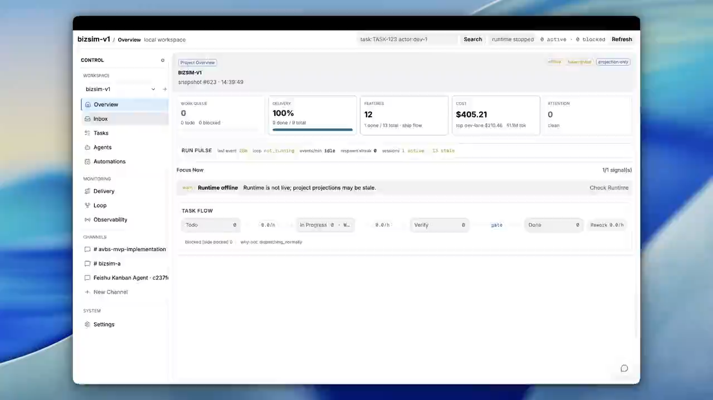

# ZaoFu / 造父

### Harness More. Yoke Less.

> AI Agent Delivery Control Plane for long-horizon software delivery.

**Developer Preview · Python 3.11+ · Apache 2.0 · Codex + Claude Code**

[中文说明](README.zh-CN.md) · [Product Tour](#product-tour) ·
[Quick Start](#quick-start) ·
[Capabilities](#core-capabilities) · [How It Works](#how-it-works) ·
[Product Surfaces](#product-surfaces) · [Documentation](#documentation)

ZaoFu turns isolated coding-agent sessions into a governed delivery team. It
does not replace Codex, Claude Code, or other provider CLIs. It gives them
roles, task contracts, runtime context, durable handoffs, evidence gates,
recovery paths, and a deterministic control boundary.

```text
ordinary coding agent
  prompt -> agent writes code -> agent says done

ZaoFu delivery
  idea / PRD / issue / refactor
    -> intake / run goal
    -> scan / plan / task map
    -> multi-agent implementation + self-check
    -> independent verification
    -> Thin Judge / completion gate
    -> scoped ship / rework / escalation

task recovery
  failure / stall
    -> Supervisor sensing -> Run Manager bounded action
    -> post-verify -> resume / owner escalation

harness improvement
  recurring failure fingerprint
    -> Autoresearch reproduction / evidence-backed diagnosis
    -> isolated repair proposal / backlog candidate
    -> verify -> human or token-gated controlled apply
```

The promise is not that the model is smarter. The promise is that agentic
delivery becomes **configurable, observable, recoverable, auditable, and
evidence-gated**.

## Product Tour

<p align="center">
  <a href="https://raw.githubusercontent.com/uisee-ai/zaofu/main/assets/readme/zaofu-v1-github-720p-small.mp4">
    
  </a>
</p>

See the Dashboard, delivery-loop observability, multi-agent Channels, Kanban
Agent, and Feishu interaction in one product walkthrough.
[Open the video](https://raw.githubusercontent.com/uisee-ai/zaofu/main/assets/readme/zaofu-v1-github-720p-small.mp4).

## Quick Start

From a ZaoFu source checkout, install the common development and runtime
dependencies, then inspect the recommended product Controller for a target
project:

```bash
cd /path/to/zaofu
uv sync --extra dev --extra web --extra stream-json

uv run zf profile bootstrap /path/to/my-project \
  --intent build --backend codex --scale launch
```

Treat the recommendation as an approval point. Continue only after confirming
that it is a `[flow]` entry from `examples/prod/controller/`, reviewing the
target project's real quality gates, and resolving Controller inputs.

The complete apply, initialization, cold-start, dry-run, startup, and first
workflow-request path is in the
[Quick Start manual](docs/manual/01-quickstart.en.md).

## Why ZaoFu

Coding agents are already strong at local code generation. The harder problem
is engineering control across a long delivery horizon:

- tasks drift from the original goal;
- parallel workers overwrite, duplicate, or block one another;
- "done" is often a chat claim rather than a verified state transition;
- evidence is scattered across terminals, transcripts, and worktrees;
- repeated failures become blind retries instead of reusable diagnosis;
- operators need progress, risk, cost, and delivery proof without reading
  every provider transcript.

ZaoFu is designed for multi-module product work, large refactors and
migrations, regression-backed issue fixing, quality hardening, and other
workflows where several coding agents must converge on one verified goal. It is
not a general workflow automation platform or a single-agent coding assistant.

## Core Capabilities

- **Product Controllers**: short YAML entries under
  `examples/prod/controller/` compile into canonical roles, stages, pipelines,
  schema policy, skill bundles, budgets, and recovery policy. Project-local
  `zf.yaml` remains the only active control-plane config.
- **Contracted multi-agent execution**: implementation and verification pin an
  immutable TaskContract snapshot. Workers return structured results,
  evidence, and artifact refs instead of transcript-only handoffs.
- **Typed call / return and lossless rework**: selected fanout and control
  calls admit typed result envelopes, repair malformed output within the same
  attempt, replay settled operations, and route negative verification back to
  the correct implementation owner.
- **Evidence-gated goal closure**: independent verification feeds Thin Judge
  synthesis; a deterministic completion gate checks the claim before scoped
  delivery emits the single terminal goal state.
- **Controlled recovery and self-improvement**: Supervisor sensing and Run
  Manager arbitration handle bounded task recovery. Autoresearch reproduces
  recurring failure patterns and produces isolated, verifiable repair or
  backlog candidates.
- **Operator-visible delivery**: Web, Kanban, Agent Sessions, Delivery Trace,
  Inbox, Channel, CLI, and Feishu expose rebuildable projections and request
  token-gated controlled actions.

## How It Works

```text
                         zf.yaml
                single control-plane config
                            |
                  profile / flow compiler
                            |
                            v
┌────────────────────────────────────────────────────────────────┐
│ Deterministic kernel + Orchestrator runtime                     │
│ dispatch / identity / schemas / mechanical gates / replay       │
│ stores / controlled actions / transitions / external effects   │
└───────────┬───────────────────────^─────────────────────┬───────┘
            | briefing + contract    | facts / intent      | truth
            v                        |                     v
┌────────────────────────────┐       |       ┌─────────────────────────────┐
│ Agent and skill layer      │───────┘       │ Read and operator surfaces  │
│ plan / impl / verify /     │               │ SQLite / Web / CLI / Feishu │
│ Thin Judge / provider CLIs │               └─────────────────────────────┘
└────────────────────────────┘
                            ^
                            | observe / request controlled action
┌───────────────────────────┴────────────────────────────────────┐
│ Run recovery: Supervisor -> Run Manager -> post-verification    │
│ Harness improvement: Autoresearch -> proposal -> verify/apply   │
└─────────────────────────────────────────────────────────────────┘
```

The control boundary is deliberate:

| Role | Authority |
|---|---|
| Kernel / Orchestrator runtime | deterministic dispatch, identity, mechanical gates, replay, state transitions, and external effects |
| Workers + skills | planning, implementation, review, diagnosis, and product judgment |
| Supervisor | observe, correlate, and raise attention; it does not repair |
| Run Manager | choose bounded recovery actions and require post-verification |
| Autoresearch | reproduce recurring patterns and propose isolated repair; it does not apply directly |
| Web / CLI / Feishu | read projections and request token-gated controlled actions |

Runtime authority is layered rather than stored in one giant file:

- `events.jsonl` is the append-only occurrence, ordering, causation, verdict,
  and reference ledger;
- kernel-managed Task, Feature, and Session stores hold current operational
  state;
- hash-addressed artifacts and sidecars preserve plans, task maps, evidence,
  diagnostics, and large semantic payloads;
- SQLite read models accelerate Timeline, Graph, Loop, Inbox, Channel, and
  Agent Session queries without becoming a second control plane.

The main loops remain separate and composable:

| Loop | Shape |
|---|---|
| Delivery | `intake -> plan -> task map -> impl -> verify -> Thin Judge -> completion gate -> ship` |
| Quality | `contract snapshot -> typed result -> evidence gate -> pass or negative handoff` |
| Task recovery | `failure/stall -> Supervisor -> Run Manager action -> post-verify -> resume/escalate` |
| Harness improvement | `recurring fingerprint -> Autoresearch -> isolated proposal -> verify -> controlled apply/backlog` |
| Human approval | `plan hold -> Web/Feishu approve or reject -> fanout unlock or repair` |
| Observability | `event/store/artifact refs -> SQLite projection -> Web/CLI -> controlled action` |

## Product Surfaces

### Controller Catalog

`examples/prod/controller/` is the only user-facing product YAML catalog:

| Controller | Use case |
|---|---|
| `prd-fanout-v3.yaml` | multi-lane PRD and product delivery |
| `prd-light-v3.yaml` | small PRD work that fits one context |
| `issue-fanout-v3.yaml` | issue, bug, and regression repair |
| `refactor-lane-v3.yaml` | large refactor, migration, and replacement work |
| `*-claude.yaml` | Claude Code variants of the same Controllers |

Controller selection and composition details live in the
[catalog guide](examples/prod/controller/README.md).

### Operator Surfaces

- **Web Dashboard**: Kanban, task detail, Agent Sessions, Channel, Inbox,
  plan approval, Delivery Trace, Runs, Graph, Loop, evidence, and controlled
  actions. See [Web, Observability, and E2E](docs/manual/06-web-observability-e2e.en.md).
- **CLI**: configuration, workflow intake, task/event/trace queries, recovery,
  projection diagnostics, workspace operations, and provider preflight. See
  [CLI Operations](docs/manual/03-cli-operations.en.md) and the
  [CLI reference](docs/manual/09-zaofu-cli-usage.en.md).
- **Feishu / ChatOps**: Channel, Kanban Agent, Run Manager decisions, streamed
  provider conversations, and Plan Ready approval cards through the same
  controlled-action boundary as Web. See the
  [Feishu direct bridge manual](docs/manual/19-feishu-ai-native-direct-bridge.en.md).

### Recovery and Autoresearch

Run Manager and Autoresearch close different feedback loops. Run Manager
restores one failed or stalled run through bounded controlled actions.
Autoresearch evaluates recurring or unresolved failure fingerprints in an
isolated scenario and produces evidence-backed diagnosis, repair proposals, or
backlog candidates.

Neither component directly mutates kernel truth or mainline code. Attempts and
budgets stay bounded, repair work is isolated, outcomes are verified, and
apply remains human- or token-gated. See the
[Autoresearch manual](docs/manual/10-autoresearch-usage.en.md).

## Documentation

| Start here | Document |
|---|---|
| First project and first request | [Quick Start](docs/manual/01-quickstart.en.md) |
| Kernel, state, and lifecycle model | [Architecture Overview](docs/manual/architecture.en.md) |
| Daily operator commands | [CLI Operations](docs/manual/03-cli-operations.en.md) |
| Web and delivery observation | [Web, Observability, and E2E](docs/manual/06-web-observability-e2e.en.md) |
| Failure diagnosis | [Troubleshooting](docs/manual/07-troubleshooting.en.md) |
| Harness evaluation and repair | [Autoresearch](docs/manual/10-autoresearch-usage.en.md) |
| All topics | [User Manual Index](docs/manual/00-index.en.md) |

## Safety and Boundaries

- `zf.yaml` is the only control-plane config.
- Runtime state belongs to `project.state_dir`; do not commit `.zf/`.
- Agents emit facts, artifacts, evidence, and intent. They do not mutate kernel
  truth directly.
- Web/API/integrations mutate state only through deterministic, token-gated
  action paths.
- Product quality gates and acceptance semantics must come from the target
  project; ZaoFu does not invent them.
- Provider CLIs can modify files and spend model budget. Validate and dry-run
  before real execution.
- Bind the Dashboard to loopback unless the network is explicitly trusted.
- Never use `tmux kill-server` to stop one project on a shared host.

## Why the Name

Zao Fu is the legendary charioteer of King Mu of Zhou, known for guiding the
Eight Steeds across a long journey. Powerful coding agents provide speed;
ZaoFu provides the harness, route, signals, pacing, recovery, and acceptance
boundary that keep the team moving toward one delivery goal.

`Harness More. Yoke Less.` means using executable contracts, evidence, and
recovery boundaries to coordinate agent power without unnecessary process
weight.

<p align="center">
  
</p>

## Status and License

ZaoFu is an implementation-active Developer Preview. The public Python API,
Web API, event schemas, and Controller profiles may change before a stable
release. Validate the current checkout rather than relying on historical
behavior.

Licensed under [Apache License 2.0](LICENSE). Use is also subject to the
[project disclaimer](DISCLAIMER.md).
