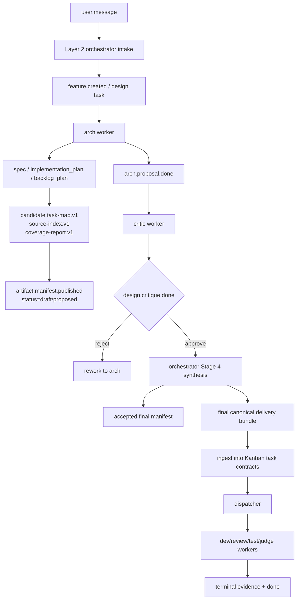
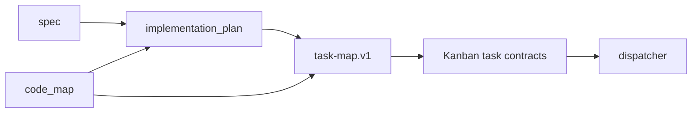
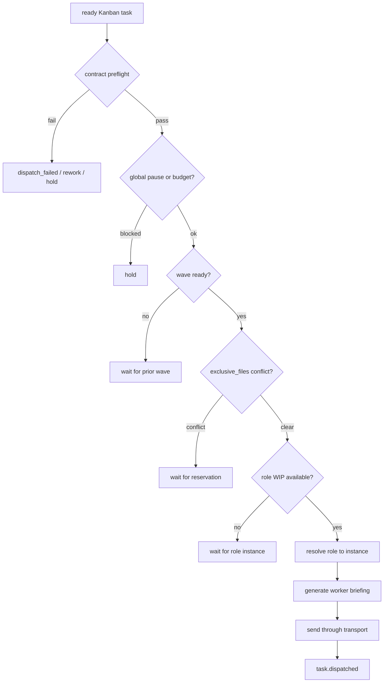
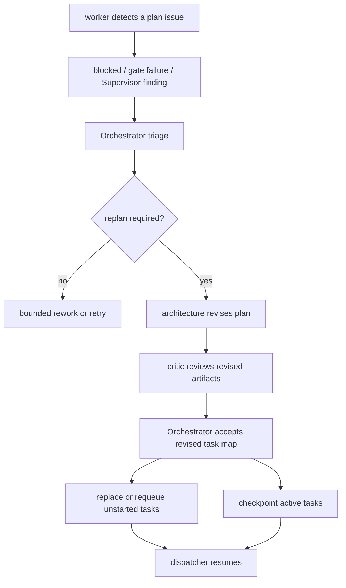

# Plan, Task Map, and Orchestrator Dispatch

> Audience: operators who need to understand how ZaoFu turns a requirement
> into a plan, splits it into tasks, and dispatches work by role, dependency,
> and code scope.

## 1. Core Conclusion

ZaoFu has a working spine from `plan` to `task-map` to Kanban task contracts.
Full and strict delivery configurations can separate arch, critic, dev, review,
test, and judge responsibilities. A project's own `zf.yaml` remains its only
control-plane configuration.

`task-map` is not yet a mandatory entry point for every product-delivery task.
Today it is enforced mainly through role skills, Orchestrator briefings, and the
product-delivery manifest path. To make codemap-driven delivery the default,
declare task-map production and consumption as an explicit workflow-stage
contract.

The closest canonical codemap carrier is `task-map.v1`. It combines code scope,
file conflicts, dependencies, and worker ownership instead of acting as a
standalone static code graph.

## 2. Concept Mapping

| Concept | Current carrier | Meaning |
|---|---|---|
| Requirement specification | `spec` artifact | Target behavior, scope, constraints, and acceptance |
| Implementation plan | `implementation_plan` artifact | Approach, phases, risk, and affected files |
| Backlog | `backlog_plan` artifact or `tasks/` | Executable task candidates |
| Code map | Fields in `task-map.v1`; optionally a future `code_map` artifact | Structure, module boundaries, owners, tests, and risky files |
| Task map | `task_map` artifact | Bridge from a plan to schedulable Kanban tasks |
| Source index | `source_index` artifact | Provenance from `task_id` to the original plan section |
| Coverage report | `coverage_report` artifact | Source coverage, unknowns, and no-invention diagnostics |
| Kanban task contract | `TaskContract` | Runtime truth consumed by dispatch, briefings, and gates |

Important boundaries:

- The source plan document is not dispatch truth.
- Architect artifacts are normally candidates, not final truth.
- The critic reviews a candidate artifact package.
- The Orchestrator accepts, merges, and relabels final artifacts and produces schedulable contracts.
- Layer 1 validates and dispatches deterministically; it does not infer task decomposition from prose.

## 3. Overall Flow



## 4. How Planning Produces Artifacts

Planning normally enters a design chain before code changes:

1. `user.message` wakes the Orchestrator.
2. The Orchestrator creates a feature and design task, usually assigned to `arch`.
3. `arch` reads code, requirements, and relevant docs and produces `spec`, `implementation_plan`, `backlog_plan`, and optionally a candidate task map.
4. `arch` publishes `artifact.manifest.published`, then `arch.proposal.done`.
5. `critic` reviews artifact references and emits `design.critique.done`.
6. After approval, Stage 4 synthesis compiles candidates into an accepted delivery bundle and executable task contracts.

External method skills can help the architect with specification, planning,
task breakdown, review, and testing. Role-gate skills provide team protocol,
handoff, and evaluator constraints. ZaoFu's repository skills adapt those
methods to events, manifests, contracts, and completion protocol. The final
result must always return to ZaoFu artifacts and task contracts.

## 5. Plan Readiness Gate

A written plan is not automatically ready for execution. Before task-map
synthesis, verify:

| Check | Passing condition |
|---|---|
| Requirement clarity | Target behavior, user value, I/O, and boundaries are explicit |
| Non-goals | Excluded scope prevents worker expansion |
| Visible assumptions | Dependencies, unknowns, and risky assumptions are listed |
| Executable acceptance | Commands, human checks, or evidence can verify each criterion |
| Test strategy | Static, runtime, E2E, or manual-evidence paths are defined |
| Code impact | Candidate modules, files, interfaces, data, or docs are named |
| Decomposability | Tasks can have explicit owners and verification |

Current readiness is primarily enforced by role protocols, artifact references,
and manifest state rather than a complete Layer 1 hard gate. An unready plan
should return to architecture or clarification, not create dev tasks. Hard
runtime checks still occur in task-map validation, contract preflight, and
dispatcher gates.

## 6. Code Map and Task Map

Short term, `task-map.v1` can carry both code scope and scheduling. A clearer
long-term boundary is:

```text
code_map
  -> code structure, module boundaries, ownership, tests, and risky files
  -> answers "how is this codebase divided?"

task_map
  -> tasks, dependencies, waves, workers, acceptance, and verification
  -> answers "how will this requirement be executed?"
```



Until `code_map` becomes separate, each task should define:

- `scope`: expected code, docs, or configuration changes; used by scope ratchet.
- `shared_files`: shared read-only context, not write permission.
- `exclusive_files`: files or modules this task exclusively writes.
- `owner_role`: executing role.
- `blocked_by` and `wave`: dependencies and execution batch.
- `verification`: executable validation entry point.

## 7. Split Work into Tasks

The canonical bundle combines `task-map.v1`, `source-index.v1`, and
`coverage-report.v1`:

```json
{
  "schema_version": "task-map.v1",
  "feature_id": "FEATURE-123",
  "source_refs": {
    "spec_ref": "docs/specs/example.md",
    "plan_ref": "docs/plans/example-plan.md",
    "source_index_ref": ".zf/artifacts/FEATURE-123/v1/source_index.json",
    "coverage_report_ref": ".zf/artifacts/FEATURE-123/v1/coverage_report.json",
    "critic_event_id": "evt-critic",
    "critic_gate_ref": "design.critique.done evt-critic approve"
  },
  "tasks": [
    {
      "task_id": "TASK-001",
      "title": "product delivery ingest",
      "owner_role": "dev",
      "plan_section": "phase-1",
      "blocked_by": [],
      "wave": 1,
      "scope": ["src/zf/runtime/product_delivery.py"],
      "shared_files": ["docs/specs/example.md"],
      "exclusive_files": ["src/zf/runtime/product_delivery.py"],
      "acceptance": ["accepted task maps create Kanban tasks"],
      "verification": "uv run pytest tests/test_product_delivery.py",
      "verification_tiers": ["static", "runtime"]
    }
  ]
}
```

Decomposition rules:

- Every task must be independently verifiable.
- Prefer vertical slices that produce observable behavior.
- Put shared infrastructure, schemas, migrations, and public APIs in earlier waves.
- Express dependencies with `blocked_by`.
- Separate concurrent writers by module and `exclusive_files`.
- Use role names such as `dev`, not random session IDs, in `owner_role`.
- References in `blocked_by` must exist in the same map.
- A path that may be written belongs in `exclusive_files`; consumers should depend on the writer.
- Acceptance and verification cannot merely say "implementation complete".
- Review, test, and judge consume contracts, artifact references, and Git evidence, not raw plans.
- New product-delivery paths publish task map, source index, and coverage report together.

## 8. Task-Map Readiness Gate

An agent proposes decomposition, but deterministic helpers decide whether it is
schedulable. Implemented hard checks include:

| Check | Passing condition |
|---|---|
| Schema | Version is empty or `task-map.v1`; tasks are a nonempty array |
| Task IDs | Unique and nonempty |
| Dependencies | `blocked_by` references tasks in the same map |
| Waves | A task never depends on a later wave |
| Exclusive files | Exact paths are not claimed by multiple tasks |
| Source refs | When present, `source_refs` is an object |
| Source index | Covers every task-map task ID |
| Coverage | Unresolved unknowns block or require operator handling |
| Acceptance | Every task has verification or acceptance |
| Contract preflight | Behavior, verification tiers, role, and paths are valid |
| Verification tiers | Only `static`, `runtime`, `e2e`, and `manual_evidence` |
| Shared/exclusive | One task cannot list a path in both |
| Scope ratchet | Scope snapshots can detect out-of-scope changes |

Recommended future hardening includes dependency-cycle detection, glob and
directory-level file conflicts, sibling shared/exclusive conflicts, bounded
scope, mandatory artifact provenance, and an optional separate code-map kind.

Malformed maps, uncovered source indexes, unresolved unknowns, dependency
cycles, unresolved file conflicts, and missing verification should fail closed
and return to architecture or Orchestrator correction.

## 9. Dispatch Workers

Layer 2 makes semantic decisions; the deterministic dispatcher makes mechanical
scheduling decisions:



Dispatch checks contract completeness, role availability, waves, file
reservations, global pause, budgets, circuit breakers, and dispatch tokens. A
task assigned to role `dev` may resolve to an idle `dev-1` or `dev-2` instance.

For a scoped task, dispatch records a snapshot. The reactor can compare changed
files on completion; fail-closed configurations emit `scope.violation` and
route to rework instead of silently advancing.

## 10. Replan and Remap During Execution

Do not continue an invalid long-horizon plan:



Typical triggers include nonexistent files or interfaces, impossible file
parallelism, invalid verification, requirement-plan mismatch, broken provenance,
and repeated rework pointing to the same planning defect.

Unstarted tasks may be replaced, canceled, or re-waved. Active tasks checkpoint
before an Orchestrator decision. Completed tasks are never silently rewritten;
if a revised plan invalidates them, create correction tasks. Workers cannot
overwrite Kanban truth with a revised plan.

## 11. Observable Codemap Signals

```bash
PYTHONPATH="$(pwd)/src" python3 -m zf.cli.main events --last 80
PYTHONPATH="$(pwd)/src" python3 -m zf.cli.main kanban --board
PYTHONPATH="$(pwd)/src" python3 -m zf.cli.main task trace <task_id>
```

Look for a durable manifest, an architecture proposal referencing it, a critic
verdict on concrete artifact refs, an accepted task map, and task contracts
containing plan/source refs, owner role, wave, file scopes, and verification.
Then verify dispatch to the expected role instance and a complete chain of
build, static gate, review, test, and judge evidence. Scoped tasks should expose
any `scope.violation` and its rework or block outcome.

Web task and trace panels should expose source section, source excerpts, wave,
dependencies, owner and instance, file scopes, artifact provenance, wait reason,
and replan history.

## 12. Current Gaps

To make codemap-driven execution the stable default:

1. Require plan, backlog, and task-map artifacts in delivery workflows.
2. Make product-delivery ingest the default business-delivery path.
3. Decide whether code scope remains in `task-map.v1` or becomes `code_map`.
4. Strengthen glob, directory, and ownership conflict detection.
5. Promote readiness checks such as cycle detection and provenance to Layer 1 gates.
6. Complete the execution-time replan/remap protocol.
7. Make dependencies, waves, ownership, file scopes, provenance, and wait reasons prominent in Web.

## 13. Code Entry Points

| Path | Responsibility |
|---|---|
| `zf.yaml` | Roles, triggers, publications, and workflow control plane |
| `src/zf/runtime/task_map.py` | Task-map schema and deterministic validation |
| `src/zf/runtime/product_delivery.py` | Convert task maps into Kanban contracts |
| `src/zf/runtime/orchestrator_reactor.py` | React to manifests, critic approval, and delivery ingest |
| `src/zf/runtime/orchestrator_dispatch.py` | Dispatch ready tasks to worker instances |
| `src/zf/runtime/injection.py` | Worker briefings and active-task protocol |
| `src/zf/core/task/schema.py` | Canonical `TaskContract` |
| `src/zf/core/task/contract_validation.py` | Strict pre-dispatch validation |
| `src/zf/core/verification/scope_ratchet.py` | Scope snapshots and violations |
