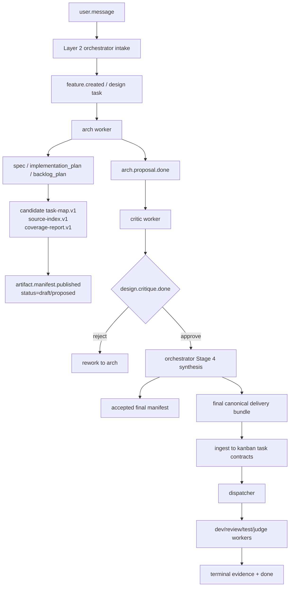
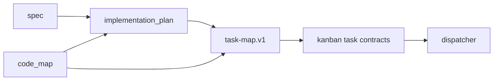
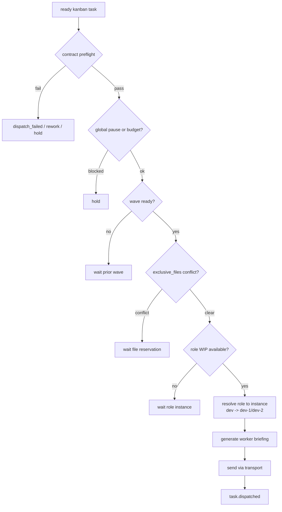
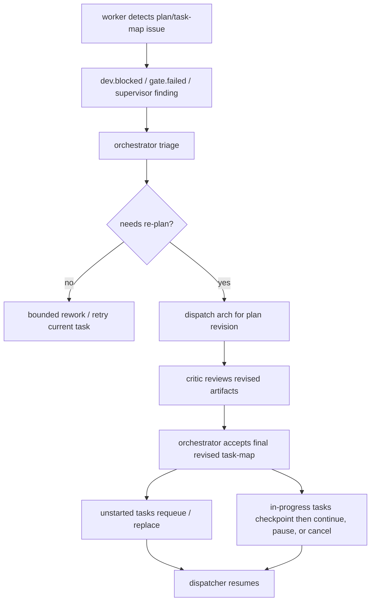

# Plan、Task Map 与 Orchestrator 调度手册

> 适用对象: 需要理解 ZaoFu 如何从需求生成计划、拆分任务,并把任务按角色、依赖和代码范围调度给不同 worker 的操作者。

## 1. 核心结论

ZaoFu 当前已经具备从 `plan` 到 `task-map` 再到 kanban task contract 的主干能力。当前 full/strict delivery 示例配置可以完成 arch、critic、dev、review、test、judge 的分工,实际项目以自己的 `zf.yaml` 为唯一控制面。

需要注意的是,当前实现还没有把 `task-map` 作为所有产品交付任务的强制入口。它目前主要通过 role skills、orchestrator briefing 和 product delivery manifest 路径约束执行。如果要让所有业务开发都稳定“按 codemap 走”,建议把 `task-map` 产出和接收写成更明确的 workflow stage contract。

在当前实现里,`codemap` 最接近的 canonical 载体是 `task-map.v1`。它不是独立静态代码图,而是包含代码范围、文件冲突、依赖和 worker owner 的任务图。

## 2. 概念对应

| 概念 | 当前载体 | 说明 |
|---|---|---|
| 需求规格 | `spec` artifact | 说明目标行为、范围、约束和验收口径 |
| 实施计划 | `implementation_plan` artifact | 说明方案、阶段、风险、文件影响面 |
| Backlog | `backlog_plan` artifact 或 `tasks/` | 说明可以被执行的任务候选 |
| Code Map / Codemap | 当前收敛在 `task-map.v1` 字段中;未来可独立为 `code_map` artifact | 描述代码结构、模块边界、owner、测试入口和风险文件 |
| Task Map | `task_map` artifact | 从计划到可调度 kanban task 的桥 |
| Source Index | `source_index` artifact | `task_id -> 原 plan/source section` 的 provenance |
| Coverage Report | `coverage_report` artifact | source coverage、unknowns、no-invention 诊断 |
| Kanban Task Contract | `TaskContract` | runtime truth,供 dispatcher、worker briefing 和 gate 使用 |

关键边界:

- 原始 plan 文档不是调度 truth。
- arch 产物通常是 candidate/proposed,不是最终 truth。
- critic 负责评审 candidate artifact package。
- orchestrator 负责接受、合并、重标记 final artifact,并生成可调度 contract。
- Layer 1 kernel 只做确定性校验和调度,不从自然语言计划里猜任务拆分。

## 3. 总体流程图



## 4. Plan 阶段如何生成计划

Plan 阶段通常不是单个 agent 直接开写代码,而是先进入设计链路:

1. `user.message` 唤醒 orchestrator。
2. orchestrator 创建 feature 和设计任务,通常先分配给 `arch`。
3. `arch` 读取代码、需求和相关 docs,产出 `spec`、`implementation_plan`、`backlog_plan` 和可选 candidate `task-map`。
4. `arch` 先发布 `artifact.manifest.published`,再发布 `arch.proposal.done`。
5. `critic` 基于 artifact refs 做设计评审,发布 `design.critique.done`。
6. orchestrator 在 approve 后执行 Stage 4 synthesis,把 candidate artifact 编译为 accepted canonical delivery bundle,并形成可执行 task contract。

`agent-skills` 和 `yoke` 的关系:

| 来源 | 在 plan 阶段的作用 |
|---|---|
| `/path/to/external-skills-root` | 提供通用 spec-driven development、planning-and-task-breakdown、review/testing 等方法 |
| `/path/to/role-gate-skills-root` | 提供 role context、orchestrator team protocol、architect handoff、gate/evaluator 等 harness 约束 |
| `zaofu/skills` | 把通用方法适配到 ZaoFu 的事件、artifact、contract 和 done protocol |

实践上,architect 可以借用 `agent-skills` 的 spec/plan/task 方法,但最终必须回到 ZaoFu 的 artifact manifest 和 task contract。

## 5. Plan Readiness Gate

Plan 写完并不等于可以进入执行。进入 task-map synthesis 前,应先确认 plan 已经达到可拆分、可验证、可调度的状态。

当前 plan readiness 主要由 arch/critic/orchestrator 的 role protocol、artifact refs 和 manifest 状态约束,还不是一个完整的 Layer 1 硬门禁。建议把下面这些检查作为进入 task-map synthesis 前的 readiness gate:

| 检查项 | 通过标准 |
|---|---|
| 需求清楚 | 目标行为、用户价值、输入输出和边界条件明确 |
| Non-goals 明确 | 不做什么写清楚,避免 worker 自行扩展范围 |
| 假设可见 | 外部依赖、未知风险、待验证假设被列出 |
| 验收可执行 | acceptance criteria 可以通过命令、人工检查或 evidence 验证 |
| 测试策略存在 | 至少有 static、runtime、e2e 或 manual evidence 中的一种明确路径 |
| 代码影响面存在 | 标出候选模块、文件、接口、数据结构或文档范围 |
| 可拆分 | 能拆成独立 task,每个 task 有明确 owner 和验证方式 |

不满足 readiness gate 时,应回到 `arch` 或 orchestrator 澄清阶段,而不是直接生成 dev 任务。进入 runtime 以后,真正的硬校验发生在 task-map validation、task contract preflight 和 dispatcher gate。

## 6. Codemap 与 Task Map 的依赖关系

短期可以继续让 `task-map.v1` 同时承载代码范围和调度关系。长期更清晰的边界是:

```text
code_map
  -> 描述代码结构、模块边界、owner、测试入口、风险文件
  -> 主要回答“这个代码库怎么切”

task_map
  -> 描述任务、依赖、wave、worker、acceptance、verification
  -> 主要回答“这次需求怎么执行”
```

推荐依赖方向:



在没有独立 `code_map` artifact 之前,`task-map.v1` 至少要把以下内容写清楚:

- `scope`: task 预期涉及的代码、文档或配置范围。它会参与 scope ratchet,不是纯说明字段。
- `shared_files`: 多个 task 可以读取的共享上下文。默认按只读理解,不表示可以写入。
- `exclusive_files`: 当前 task 独占写入的文件或模块。
- `owner_role`: 谁负责执行。
- `blocked_by` / `wave`: 执行依赖和批次。
- `verification`: 验证入口。

## 7. 如何拆任务

真正可调度的拆分结果应进入 canonical delivery bundle。`task-map.v1`
负责任务图,`source-index.v1` 负责每个 task 的原文 source,`coverage-report.v1`
负责 coverage 和 unknowns 诊断。典型 `task-map` 字段:

```json
{
  "schema_version": "task-map.v1",
  "feature_id": "FEATURE-123",
  "source_refs": {
    "spec_ref": "docs/specs/example.md",
    "plan_ref": "docs/plans/example-plan.md",
    "tdd_ref": "docs/plans/example-plan.md#test-plan",
    "source_index_ref": ".zf/artifacts/FEATURE-123/v1/source_index.json",
    "coverage_report_ref": ".zf/artifacts/FEATURE-123/v1/coverage_report.json",
    "critic_event_id": "evt-critic",
    "critic_gate_ref": "design.critique.done evt-critic approve"
  },
  "tasks": [
    {
      "task_id": "TASK-001",
      "title": "product delivery ingest",
      "owner_role": "dev",
      "plan_section": "phase-1",
      "blocked_by": [],
      "wave": 1,
      "scope": ["src/zf/runtime/product_delivery.py"],
      "shared_files": ["docs/specs/example.md", "docs/plans/example-plan.md"],
      "exclusive_files": ["src/zf/runtime/product_delivery.py"],
      "acceptance": ["product delivery creates kanban tasks from accepted task-map"],
      "verification": "uv run pytest tests/test_product_delivery.py",
      "verification_tiers": ["static", "runtime"]
    }
  ]
}
```

拆任务时建议遵守:

- 每个 task 必须能独立验证。
- 优先按 vertical slice 拆分,让一个 task 对应一个可观察的行为变化。
- 不要只按技术层横切,例如“先改所有 schema,再改所有服务,再改所有 UI”,除非这些层本身是独立可验证交付。
- 共享基础设施、schema、迁移、公共 API 优先放在较早 wave。
- 依赖上游 API、schema 或数据结构的任务必须显式写 `blocked_by`。
- 多 dev 并发时,优先按模块边界和 `exclusive_files` 拆分。
- `owner_role` 应写 role name,例如 `dev`、`review`、`test`,不要写随机 session id。
- `blocked_by` 只引用同一个 task-map 内存在的 task。
- `wave` 用来表达批次。后续 wave 会等待前置 wave 完成。
- `exclusive_files` 用来避免多个 writer 同时改同一文件。
- `shared_files` 表示只读共享上下文,不等于独占写锁。任何会写的路径都必须进入 `exclusive_files`;如果其他 task 需要消费写入结果,应通过 `blocked_by` 串联。
- acceptance 和 verification 不能只写“完成实现”,必须写可检查条件。
- review/test/judge 不应该消费 raw plan,而应消费 task contract、artifact refs 和 git evidence。
- 新 product delivery 主路径必须同时发布 `task_map/source_index/coverage_report`;
  legacy/manual task 缺 source index 时可以 degraded,但必须在 Task Capsule audit 中可见。

## 8. Task Map Readiness Gate

`task-map` 进入 kanban 前,需要通过 deterministic readiness gate。agent 可以提出拆分,但最终是否可调度应由 kernel/helper 做结构校验。

当前已经实现的硬校验:

| 检查项 | 通过标准 |
|---|---|
| schema | `schema_version` 为空或 `task-map.v1`;`tasks` 是非空数组 |
| task id | 所有 `task_id` 唯一且非空 |
| dependency | `blocked_by` 只能引用同一个 task-map 内存在的 task |
| wave | task 不能依赖更晚 wave 的 task |
| exclusive files | `exclusive_files` 精确路径不能被多个 task 同时声明 |
| source refs | `source_refs` 如果存在,必须是 object |
| source index | `source_index.tasks[*].task_id` 必须覆盖 `task_map.tasks[*].task_id` |
| coverage report | `unresolved_unknowns` 非空时不得当作 absent,应阻断或人工处理 |
| acceptance / verification | 每个 task 至少有 `verification` 或 `acceptance` |
| contract preflight | 派发前校验 `behavior`、`verification`、`verification_tiers`、role、路径字段等 |
| verification tiers | 只能使用 `static`、`runtime`、`e2e`、`manual_evidence` |
| shared/exclusive | 单个 task 的 `shared_files` 不能和自己的 `exclusive_files` 重叠 |
| scope ratchet | 带 `scope` 的 task 派发时会记录快照,完成后可检查越界变更 |

推荐补强但当前不能当作完整硬保证的 gate:

| 检查项 | 目标 |
|---|---|
| dependency cycle | 检测同 wave 或跨 wave 依赖环,不只检查引用存在 |
| semantic file conflict | 对 `exclusive_files` 做 glob、目录级、模块 owner 级冲突检测 |
| sibling shared/exclusive conflict | 在普通 product delivery 调度中也检查并发 sibling 的 shared/exclusive 冲突 |
| scope completeness | 禁止无边界的“全仓库大任务”,或要求人工 override |
| artifact refs | 强制能追溯到 spec、plan、critic verdict 或 evidence contract |
| code_map artifact | 如有需要,把代码结构和 owner 图从 `task-map.v1` 中拆为独立 artifact |

可接受的失败处理:

- task-map 结构错误: fail closed,回到 orchestrator/arch 修正。
- source-index 缺失或不覆盖 task-map: fail closed,不创建 dispatch-ready task。
- coverage report 有 unresolved unknowns: fail closed 或回到人工确认,不能让 worker 猜。
- 依赖图有环: 当前建议 fail closed;完整环检测需要补强后才能作为硬保证。
- 文件冲突不可并发: 调整 wave 或 `exclusive_files`。
- 验证缺失: 不允许派发给 dev。

## 9. 执行阶段如何调度 worker

执行阶段由 deterministic dispatcher 做机械调度。Layer 2 orchestrator 负责语义决策,Layer 1 dispatcher 负责是否可以安全派发。



调度决策重点:

| 检查点 | 作用 |
|---|---|
| contract preflight | 缺 behavior、verification、scope 等关键字段时 fail closed |
| role availability | 同一 worker WIP 受限,多副本 role 会选择空闲实例 |
| wave | 保证批次顺序,避免后续任务提前写入 |
| `exclusive_files` | 避免并行 writer 改同一文件 |
| pause / budget / circuit breaker | 避免异常状态继续派发 |
| dispatch token | worker 完成事件必须能对上本轮 dispatch |

默认 `zf.yaml` 中 `dev` 可以有多个副本。dispatcher 接收 `assigned_to=dev` 后,会把它解析到空闲的 `dev-1`、`dev-2` 等具体实例。

如果 task contract 带有 `scope`,dispatcher 会在派发前记录 scope snapshot。worker 完成后,reactor 可以把实际变更文件与 `scope` 比对;在 fail-closed 配置下,越界变更会触发 `scope.violation` 并回到 rework,而不是静默进入 review。

## 10. 执行中 Re-plan / Re-map

长程任务中 plan 失效是正常情况。不要让 worker 在已知 plan 错误时继续沿着旧 task-map 执行。

推荐机制:



触发 re-plan 的常见信号:

- worker 发现 plan 中的文件、接口或依赖不存在。
- `exclusive_files` 冲突导致并发策略不可行。
- verification 无法执行或验证对象不成立。
- critic/review/test 指出 plan 与需求不一致。
- supervisor 发现 plan/task/evidence 断链。
- 多轮 rework 都指向同一个计划缺陷。

re-plan 的边界:

- 未开始 task 可以直接替换、取消或重新排 wave。
- in-progress task 应先 checkpoint,再由 orchestrator 决定继续、暂停或取消。
- 已完成 task 不应被静默改写;如果新 plan 推翻旧完成结果,应生成新的 correction task。
- kernel 只接受新的 final artifact,不让 worker 直接覆盖 kanban truth。

## 11. 按 codemap 走的可观察信号

一次任务是否真的按 plan/task-map/codemap 走,可以检查以下信号:

```bash
PYTHONPATH="$(pwd)/src" python3 -m zf.cli.main events --last 80
PYTHONPATH="$(pwd)/src" python3 -m zf.cli.main kanban --board
PYTHONPATH="$(pwd)/src" python3 -m zf.cli.main task trace <task_id>
```

重点看:

- 是否有 `artifact.manifest.published`。
- `arch.proposal.done` 是否引用了 durable artifact。
- `design.critique.done` 是否 approve 了具体 artifact refs。
- 是否出现 final `task_map` 或 product delivery accepted 事件。
- kanban task contract 是否有 `plan_ref`、`spec_ref`、`source_index_ref`、`source_ref/source_key`、`owner_role`、`wave`、`exclusive_files`、`verification`。
- `task.dispatched` 是否派发到预期 role instance。
- 后续 `dev.build.done`、`static_gate.passed`、`review.approved`、`test.passed`、`judge.passed` 是否形成完整证据链。
- 带 `scope` 的 task 是否出现 `scope.violation`,以及该 violation 是否按配置阻断或转 rework。

Web / trace / task panel 最好直接展示:

- 当前 task 来自哪个 plan section。
- 当前 task 的 `source_index_ref/source_mode/source_excerpt`。
- `wave`、`blocked_by` 和依赖等待原因。
- `owner_role`、具体 worker instance 和 dispatch id。
- `exclusive_files`、`shared_files` 和冲突等待原因。
- `spec_ref`、`plan_ref`、`critic_event_id`、`critic_gate_ref`。
- 未派发原因: 等 wave、等文件锁、等 worker、contract 不完整、budget/pause/circuit breaker。
- re-plan 历史: 旧 task-map、新 task-map、替换/取消/继续的 task 列表。

## 12. 当前缺口和推荐补强

当前能力已经能支撑多 agent、long-horizon 的产品交付主线,但要把“按 codemap 走”变成稳定默认行为,还需要补强几处:

1. 在 `zf.yaml` 中显式声明 plan 阶段必须产出 `implementation_plan`、`backlog_plan` 和 `task_map`。
2. 把 product delivery task-map ingest 作为业务交付任务的默认路径,而不是只在特定 manifest 模式下触发。
3. 明确 `codemap` 的命名边界: 继续使用 `task-map.v1` 承载代码范围,或新增独立 `code_map` artifact kind。
4. 增强 `exclusive_files` 的 glob、目录级和模块 owner 冲突检测。
5. 把 plan readiness gate 和 task-map readiness gate 的推荐检查继续下沉为 Layer 1 硬门槛,尤其是依赖环检测、semantic file conflict 和 artifact refs 强制追溯。
6. 增加执行中 re-plan/re-map 协议,让 worker 发现计划缺陷时能安全回到设计链路。
7. 在 Web / trace / task panel 中突出展示 `wave`、`blocked_by`、`owner_role`、`exclusive_files`、artifact refs 和未派发原因。

## 13. 代码入口

常用核查入口:

| 位置 | 作用 |
|---|---|
| `zf.yaml` | 唯一控制面,定义角色、触发事件、发布事件、workflow |
| `src/zf/runtime/task_map.py` | task-map schema 和 deterministic 校验 |
| `src/zf/runtime/product_delivery.py` | task-map 转 kanban task contract |
| `src/zf/runtime/orchestrator_reactor.py` | artifact manifest、critic approve、product delivery ingest 的事件反应 |
| `src/zf/runtime/orchestrator_dispatch.py` | ready task 到 worker instance 的派发逻辑 |
| `src/zf/runtime/injection.py` | worker briefing 注入和 active task protocol |
| `src/zf/core/task/schema.py` | canonical `TaskContract` 字段定义 |
| `src/zf/core/task/contract_validation.py` | dispatch 前的 strict task contract 校验 |
| `src/zf/core/verification/scope_ratchet.py` | scope snapshot、diff 和越界检查 |
