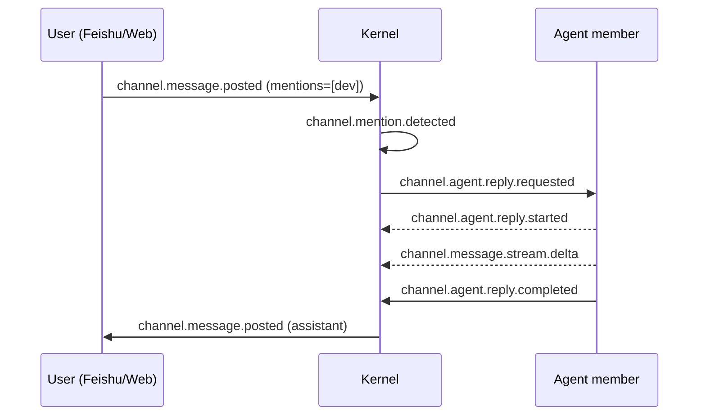

# Channel Collaboration

> Audience: operators coordinating one or more agents in a shared conversation
> and projecting that conversation to Web or Feishu.
>
> Status: the implemented core includes posting, mention-triggered replies, and
> event projections. Some multi-member policies, full channel-to-workflow
> bridging, and provider adapters remain incomplete.

## 1. What a Channel Is

A Channel is an event-driven shared conversation. Users and agent members post
messages; mentioned agents reply; the lifecycle is recorded as `channel.*`
events in `events.jsonl` and can be rebuilt as a projection.

There is no static `channel group` section in `zf.yaml`. Channels are created at
runtime through `channel.created`, and the model is channel plus members.
Inbound messages can come from Feishu or Web. A Feishu `target: agent` creates a
temporary channel; `target: channel` routes to an existing one.

## 2. Post with `zf channel say`

The stable Channel CLI command is `say`. It uses the
`channel-post-message` controlled action rather than directly holding Feishu
credentials or invoking a transport:

```bash
zf channel say <channel_id> \
  --text "Review passed; @dev may merge" \
  --member-id reviewer \
  --mention dev
```

| Option | Meaning | Default |
|---|---|---|
| `channel_id` | Target channel | required |
| `--text` | Message text | required |
| `--member-id` | Sender member identity | `agent` |
| `--mention` | Mention a member; repeatable | none |
| `--state-dir` | Explicit runtime state | project context |

The action emits `channel.message.posted`. A mention matching an agent member
requests its reply.

## 3. Conversation Event Chain



Observe messages with:

```bash
zf events --last 50 | grep channel.
zf channel say ch-zaofu --text "status?" --member-id agent
```

Member lifecycle events include `channel.member.invited`,
`channel.member.added`, `channel.member.connected`,
`channel.member.suspended`, and `channel.member.removed`.

## 4. Route Feishu into a Channel

Bind a Feishu group to an agent:

```yaml
integrations:
  feishu_routing:
    oc_<chat_id>:
      target: agent
      backend: codex
      cwd: /path/to/repo
      default_member: zf-coder
```

This creates a temporary `agent-<chat_id>` channel and agent member. To deliver
to an existing multi-member channel, configure `target: channel` and
`channel_id`; see [Feishu AI-Native Direct Bridge](19-feishu-ai-native-direct-bridge.en.md).

## 5. Current Boundaries

- Only `zf channel say` is a stable Channel CLI command. List, show, invite,
  synthesize, and archive actions use controlled Web/API paths where available.
- Speaker policies such as round-robin and leader delegation are not complete.
- Discussion mode supports `mention_relay` with bounded relay depth and
  `fanout_then_synthesis` with blind-answer, relay, and synthesis phases.
- Under the default `manual_mention` mode, an agent reply does not automatically
  fan out. `channel.route.blocked: auto_route_not_allowed` is expected behavior.
- The full `channel.synthesis.proposed` to `workflow.invoke.requested` bridge
  must be verified against current code before use.
- Direct `target: agent` replies work; complex multi-provider collaboration is
  not yet a stable contract.

## 6. Member Values

`channel-invite-member` rejects unknown enum values with HTTP 422.

Supported `member_type` values include `automation_reporter`, `claude-code`,
`codex`, `hermes`, `human`, `observer`, `openclaw`, `owner_delegate`, `persona`,
`persona_agent`, `provider_agent`, `readonly-reviewer`, `runtime-role`, and
`runtime_role_binding`. Bind a configured workflow role with `runtime-role` and
`workflow_role_binding: {"role": "<instance_id>"}`.

Supported `channel_role` values include `arch`, `automation_reporter`, `critic`,
`dev_reviewer`, `facilitator`, `observer`, `owner_delegate`, `product_pm`,
`qa_analyst`, `researcher`, `security_reviewer`, `spine_reviewer`,
`synthesizer`, and `tech_leader`.

Example:

```json
{
  "channel_id": "ch-demo",
  "member_id": "prd-author",
  "backend": "codex",
  "member_type": "runtime-role",
  "channel_role": "product_pm",
  "skill_refs": ["zf-channel-discussion-participant"],
  "workflow_role_binding": {"role": "prd-author"}
}
```

Channel member `skill_refs` materialize literal `skills/<name>/SKILL.md` paths;
they do not use the workflow-role skill-pool conflict resolver.

## 7. Related Manuals

- [Feishu AI-Native Direct Bridge](19-feishu-ai-native-direct-bridge.en.md)
- [Architecture](architecture.en.md)
