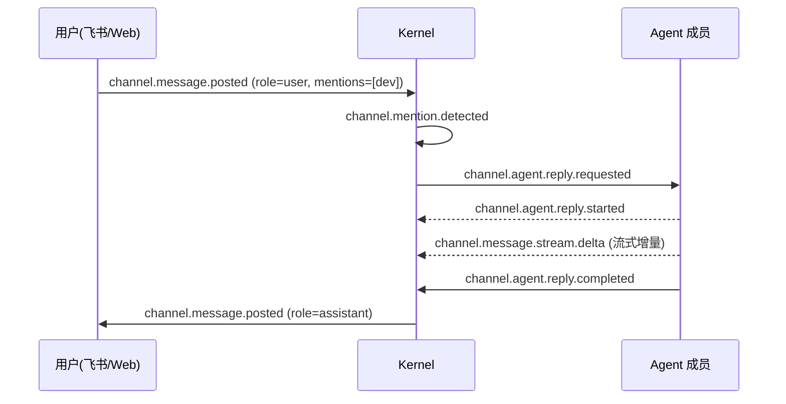

# Channel 协作使用手册

> 适用对象: 想让一个或多个 agent 在一个共享对话空间里协作、并把对话投影到飞书 / Web 的操作者。
>
> 状态: **当前可用范围版**。Channel 的核心(发消息、@mention 触发 agent 回复、事件投影)
> 已落地;多成员编排(speaker policy、discussion mode、channel→workflow 完整桥接)仍是
> 规划中,provider adapter 部分 WIP。本手册只覆盖**已实现**部分,规划项在文末"当前边界"列明。

## 1. Channel 是什么

Channel 是一个事件驱动的共享对话空间:用户和一个/多个 agent 成员在里面发消息,
agent 被 @mention 时回复,全过程以 `channel.*` 事件落到 `events.jsonl`,可重建为投影。

两点需要先澄清:

- **没有 "channel group" 静态配置块**。Channel 是**运行时动态创建**的(`channel.created`
  事件),不在 `zf.yaml` 里预声明。代码里的概念是 **channel + member**,不是 "channel group"。
- **入站来源** 可以是飞书(`feishu_routing` 的 `target: agent` 会自动建一个临时 channel,
  `target: channel` 投递到已有 channel,见 [19](19-feishu-ai-native-direct-bridge.md) §3.1)
  或 Web Dashboard。

## 2. 发消息:`zf channel say`

当前唯一的 channel CLI 是 `say` —— 以某个成员身份往 channel 发一条消息。它**不直接持有
飞书凭证、不直接调 transport**,而是走 `channel-post-message` ControlledAction(与 Web/飞书
入站同一套白名单 + 审计门,`src/zf/cli/channel.py`):

```bash
zf channel say <channel_id> \
  --text "评审已通过,请 @dev 合并" \
  --member-id reviewer \
  --mention dev          # 可重复:--mention dev --mention test
```

| 参数 | 含义 | 默认 |
|---|---|---|
| `channel_id` | 目标频道 | (必填) |
| `--text` | 消息正文 | (必填) |
| `--member-id` | 以哪个成员身份发(agent 身份) | `agent` |
| `--mention` | @mention 一个成员,可重复 | 空 |
| `--state-dir` | 指定运行态目录 | 按 project context 解析 |

发出后产生一条 `channel.message.posted`;若 `--mention` 命中 agent 成员,会触发其回复流程。

## 3. 一次对话的事件链

用户发言 → @mention 解析 → agent 回复 → 流式增量 → 完成,核心事件
(全量定义见 `src/zf/runtime/channel_projection.py` `CHANNEL_EVENT_TYPES`):



常用观测:

```bash
zf events --last 50 | grep channel.
zf channel say ch-zaofu --text "..." --member-id agent   # 也可用于人工补一条
```

成员生命周期相关事件:`channel.member.invited` / `channel.member.added` /
`channel.member.connected` / `channel.member.suspended` / `channel.member.removed`。

## 4. 从飞书进 channel

最常见的入口是飞书。在 `zf.yaml` 把一个群绑到 agent,消息就会自动进入一个 channel:

```yaml
integrations:
  feishu_routing:
    oc_<群的_chat_id>:
      target: agent        # 自动建临时 channel(channel_id = agent-<chat_id>)+ agent 成员
      backend: codex
      cwd: /path/to/repo
      default_member: zf-coder
```

要让一个群投递到**已有**的、可多成员协作的 channel,用 `target: channel` + `channel_id`
(见 [19](19-feishu-ai-native-direct-bridge.md) §3.1 的 target 对照表)。

## 5. 当前边界(诚实说明)

下列功能**已规划但尚未作为可用功能交付**,本手册不教其用法:

- **CLI 只有 `zf channel say`**。`list` / `show` / `invite` / `synth` 等未实现。成员邀请、
  归档等目前经 ControlledAction / Web API,不是稳定 CLI 面。
- **多成员编排** —— speaker policy(round-robin / leader-delegation)未实现;
  **discussion mode 策略层已落地**(2026-07-06 bizsim r4 核实更新):经受控动作
  `channel-discussion-mode` 可设 `mention_relay`(agent 帖内 @mention 定向转发,
  relay 深度上限默认 4)或 `fanout_then_synthesis`(三阶段:phase1_blind 盲答 →
  phase2_relay 互相转发 → phase3_synthesis 收敛)。**默认 `manual_mention` 下
  agent 回帖不自动扇出**(doc 64 §5 防风暴守卫),事件流表现为
  `channel.route.blocked: auto_route_not_allowed`——这是设计内行为,不是故障;
  要 agent 间真实互达必须先设 relay 模式。
- **channel → workflow 完整桥接** —— `channel.synthesis.proposed` →
  `workflow.invoke.requested` 的链路在设计中,生产可用性以代码为准,勿假设已闭环。
- **provider adapter** —— Codex / Claude-Code 在 channel 内的连接器部分 WIP;
  `target: agent` 直连回复路径已可用,复杂多 provider 协作未稳定。

需要这些能力时,先 `grep` 现网符号确认是否已落地,不要照设计文档当成已交付。

## 成员管理值域(bizsim r4 教育配对)

经受控动作 `channel-invite-member`(POST `/api/projects/<id>/actions/channel-invite-member`)
邀请成员时,两个枚举字段值域如下——传错会被 422 拒绝,错误信息会回显合法值:

- `member_type`:`automation_reporter` / `claude-code` / `codex` / `hermes` /
  `human` / `observer` / `openclaw` / `owner_delegate` / `persona` /
  `persona_agent` / `provider_agent` / `readonly-reviewer` / `runtime-role` /
  `runtime_role_binding`。绑定 zf.yaml 已声明角色用 `runtime-role` +
  `workflow_role_binding: {"role": "<instance_id>"}`。
- `channel_role`:`arch` / `automation_reporter` / `critic` / `dev_reviewer` /
  `facilitator` / `observer` / `owner_delegate` / `product_pm` / `qa_analyst` /
  `researcher` / `security_reviewer` / `spine_reviewer` / `synthesizer` /
  `tech_leader`。

示例(绑定 prd-author 角色为产品视角参与者):

```json
{"channel_id": "ch-demo", "member_id": "prd-author",
 "backend": "codex", "member_type": "runtime-role",
 "channel_role": "product_pm",
 "skill_refs": ["zf-channel-discussion-participant"],
 "workflow_role_binding": {"role": "prd-author"}}
```

`skill_refs` 会按字面路径物化 `skills/<name>/SKILL.md` 给成员会话
(与 roles 的 skills 解析不同,不走 skill pool 冲突消解)。

## 相关

- [19 Feishu AI-Native 直连 Bridge](19-feishu-ai-native-direct-bridge.md) — 入站绑定与 target 类型
- [架构总览](architecture.md) — 事件溯源与三层架构的整体模型
