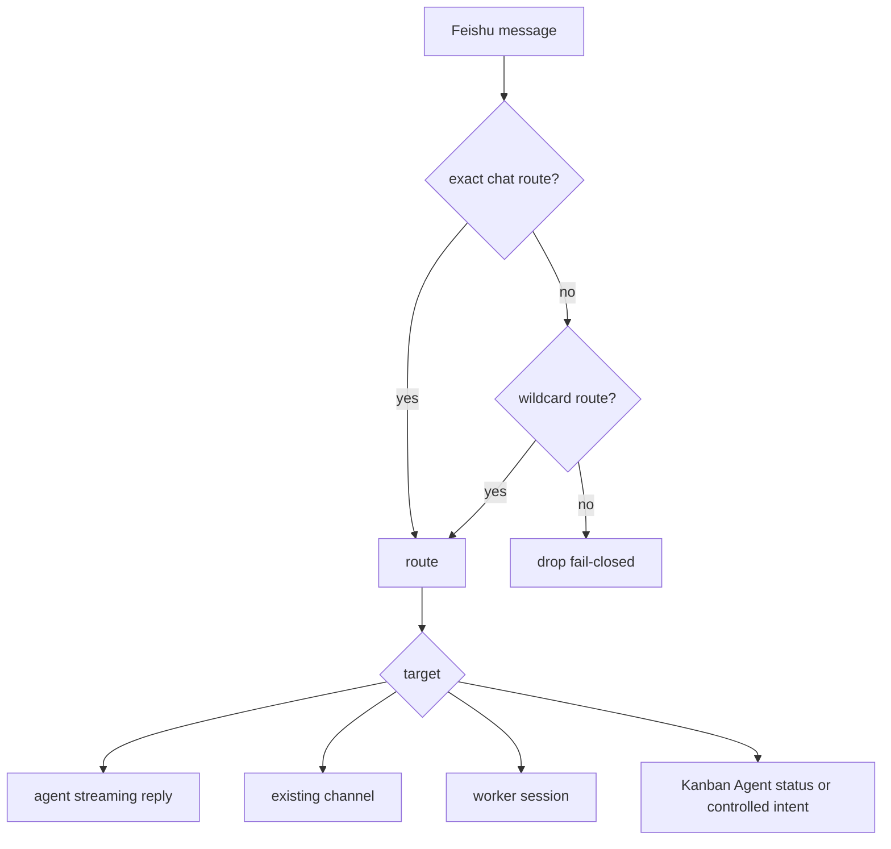

# Feishu AI-Native Direct Bridge

> Status: active. This bridge drives real ZaoFu coding agents directly from
> Feishu group chats and DMs, including streaming replies and plan approval.
> It replaces the deprecated OpenClaw message-forwarding path.

## 0. Summary

`zf feishu bridge --watch` maintains one process-level Feishu connection. A
group mention or DM reaches a real Codex or Claude Code agent, whose response is
streamed into a rich card. Plan approval buttons go through identity checks and
controlled actions to unlock delivery. No public webhook or OpenClaw relay is
required.

OpenClaw can still be a remote execution backend; it is no longer the Feishu
message transport.

## 1. Direct Architecture

```text
Feishu group mention or DM
  |
  | official WebSocket long connection
  v
zf feishu bridge --watch
  |- reply only to this bot in multi-bot groups
  |- debounce messages per chat
  |- dispatch asynchronously and stream progress
  |- catch up messages received during restart gaps
  v
real headless backend: codex or claude-code
  v
streaming rich card -> FeishuHttpTransport -> source chat

card.action.trigger
  -> approver identity gate
  -> ControlledAction
  -> plan.approved
  -> Orchestrator fanout
```

One Feishu application uses one WebSocket connection for all its groups and DMs.

## 2. One-Time Setup

### 2.1 Create the Application

In the Feishu developer console, create an internal application, enable its bot,
grant message and chat permissions, publish the application version, configure
long-connection events and callbacks, and add the bot to target groups.

To obtain a group `chat_id`, mention the bot and read `chat=oc_...` in bridge
logs. To obtain an approver `open_id`, read `by ou_...`. Keep credentials and
real IDs in `.env`; never commit them.

### 2.2 Install the Optional SDK

```bash
uv sync --extra dev --extra stream-json --extra feishu
uv run python -c "import lark_oapi; print('lark_oapi ok')"
```

For an editable pip environment, install `.[feishu]`. The bridge fails at import
when the optional SDK is absent and fails fast when app credentials are missing.

### 2.3 Configure Feishu

In the application console:

1. Receive `im.message.receive_v1` through a long connection, not a public URL.
2. Receive card callbacks through the same long-connection mode.
3. Grant message, group-read, and bot-info permissions.
4. Add the bot to target groups; groups require a mention, while DMs do not.

### 2.4 Credentials

```bash
FEISHU_APP_ID=cli_xxxxxxxxxxxx
FEISHU_APP_SECRET=xxxxxxxxxxxxxxxxxxxxxxxx
```

Place these in the project `.env` or export them.

## 3. Configuration

```yaml
integrations:
  feishu_routing:
    oc_<chat_id>:
      target: agent
      backend: codex
      cwd: /path/to/repo
      default_member: zf-coder
    "*":
      target: agent
      backend: codex
      cwd: /path/to/repo
      default_member: zf-coder

  feishu_identity:
    enabled: true
    users:
      ou_<open_id>:
        operator: owner
        level: approver
```

Adapter settings may instead live in a sibling `feishu.yaml`, either at the top
level or under `integrations`. The loader merges them into the same validated
`ZfConfig`; this is not a second control plane. Defining the same key in both
files is an error rather than silent precedence.

### 3.1 Route Targets

| Target | Purpose | Required field |
|---|---|---|
| `agent` | Create a temporary channel and one streaming agent | `backend`, `cwd` |
| `channel` | Deliver into an existing multi-member ZaoFu Channel | `channel_id` |
| `worker` | Bridge into an existing worker session | `worker_session_id` |
| `kanban_agent` | Return read-only project status or record operator intent | none |

`default_member` supplies the default mention. Routing is fail-closed: exact
chat ID, then wildcard, otherwise drop without replying.



## 4. Start the Bridge

Recommended tmux wrapper:

```bash
cd /path/to/project
scripts/feishu-bridge-watch.sh start
scripts/feishu-bridge-watch.sh attach
scripts/feishu-bridge-watch.sh status
scripts/feishu-bridge-watch.sh stop
```

For a development checkout, override `ZF_BIN` and `PYTHONPATH` as needed.

Foreground mode:

```bash
zf feishu bridge --watch --debounce-ms 600
```

Startup should show the application, bot ID, debounce interval, and WebSocket
connection. Code changes require a bridge restart; catchup replays the restart
gap.

## 5. Usage

### 5.1 Streaming Group and DM Replies

Mention the bot in a group or message it directly. A card appears quickly,
streams text and tool activity, and folds longer tool histories. In multi-bot
groups, messages mentioning another bot are ignored.

### 5.2 Plan Approval

When `task_map.ready` arrives with plan approval enabled, writer fanout is held
and an inline approval card lists tasks and scope. An identity-authorized button
click goes through `ControlledAction`, emits operator-owned `plan.approved`, and
allows the Orchestrator to fan out. The card does not depend on Web deep links.
Use `zf plan approve <plan_id>` as the offline CLI fallback when available in the
current CLI.

### 5.3 Outbound Alerts

```bash
zf feishu push --watch
```

This sends integration, development, rework, delivery, approval, and Run Manager
cards directly through Feishu transport.

### 5.4 Kanban Agent Inbound

With `target: kanban_agent`, status and progress questions return a read-only
project summary card and write no event. Action requests create
`operator.intent.created`; the agent recommends but does not apply. Actual
mutation still needs operator confirmation and a controlled action, and plan
approval remains agent-forbidden.

The Kanban Agent is not a runtime or tmux control plane. The path is always
intent, controlled action, then kernel.

### 5.5 Run Manager Human Decisions

Run Manager escalations can render cards with approved controlled action,
Autoresearch diagnosis, and safe shutdown options. Button clicks pass through
identity and controlled-action gates; later ticks observe the applied decision
and send receipt or progress cards. Feishu only notifies and requests authorized
mutation; it never bypasses runtime truth.

## 6. Robustness

- `ws-<app_id>.lock` prevents competing consumers for one app.
- Catchup replays deduplicated messages after restart gaps, but does not replay all history on first deployment.
- Multi-bot mention filtering prevents unintended replies.
- Per-chat debounce merges bursts and serializes work in one chat.

## 7. Troubleshooting

| Symptom | Action |
|---|---|
| Card callback is not configured or offline | Configure long-connection callbacks; allow stale connections to expire |
| Mention gets no reply | Mention this bot, then restart and let catchup replay if needed |
| Approval has no permission | Map the sender as `approver` in `feishu_identity` |
| Rich-card HTTP 400 | Inspect stderr for invalid card JSON |
| Code change has no effect | Stop and restart the resident bridge |
| WebSocket 1011 ping timeout | Reduce host load and restart; catchup covers the gap |

## 8. OpenClaw Boundary

The deprecated OpenClaw-to-Feishu forwarding bridge is not the message path.
`backend: openclaw` remains valid for remote agent execution independently of
Feishu delivery.

## 9. Related

- [Channel Collaboration](15-channel-collaboration.en.md)
- [Feishu Automation and Kanban Sync](11-feishu-automation-kanban-sync.en.md)
- `examples/feishu-bridge-watch.yaml`
- `scripts/feishu-bridge-watch.sh`
