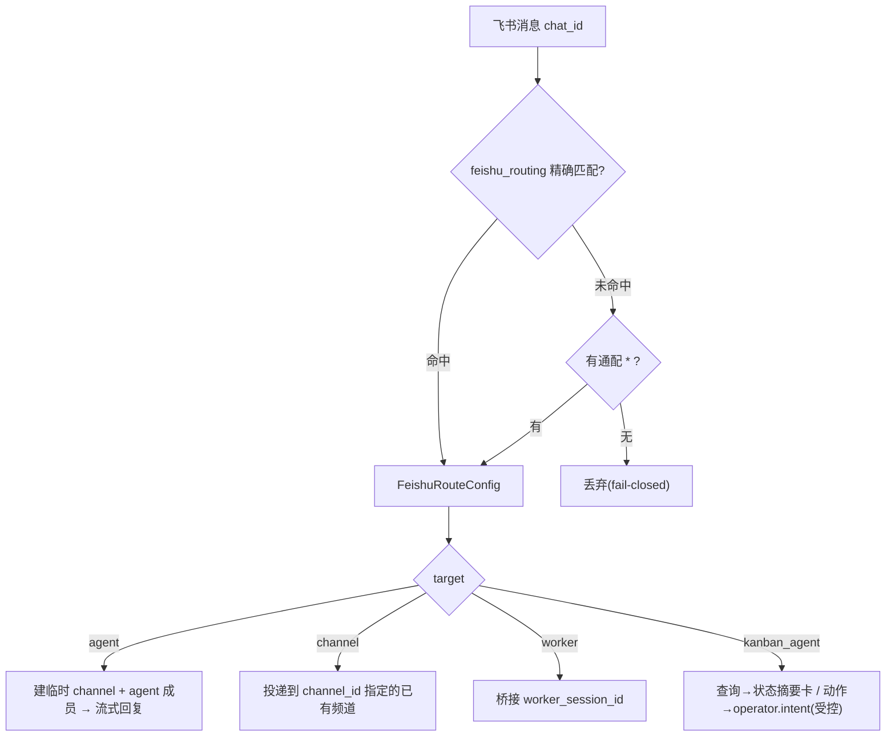

# Feishu AI-Native 直连 Bridge 使用手册

> 状态: active(2026-06-22)
> 适用范围: 从飞书直接驱动 ZaoFu coding agent —— 群聊/单聊问答(流式)+ 计划审批离场闭环。
> 取代: 旧的 OpenClaw 转发链路("Feishu /zf → OpenClaw forwarder → ZaoFu" 入站路径,
> 已废弃)。本手册用 ZaoFu **直连飞书**(官方 lark-oapi 长连接 + FeishuHttpTransport),
> 不再经 OpenClaw 中转。

---

## 0. 一句话

`zf feishu bridge --watch` 起一个进程内常驻 bridge:飞书群 @ 机器人 / 私聊 → 真 coding agent
(codex / claude-code)回复,**流式卡片**实时打字机回到群里;计划审批卡在飞书**点按钮**即可
解锁 agentic 交付。**不需要 OpenClaw、不需要公网 webhook。**

OpenClaw 仍可作为"远程 agent 执行后端"(`backend: openclaw`),但**飞书消息中转**(`zf bridge
openclaw-feishu`)已废弃——告警/卡片本来就走直连 `FeishuHttpTransport`。

---

## 1. 架构(直连,无中转)

```text
飞书群 @机器人 / 私聊
  │  (官方 WebSocket 长连接,免公网 webhook)
  ▼
zf feishu bridge --watch  ──┐
  ├─ 只回真正 @ 本 bot 的(多 bot 群)/ 单聊照回
  ├─ per-chat 防抖(连发合并一轮)
  ├─ 异步派发(不阻塞 WS 心跳)+ 进度推送(Thinking→流式)
  ├─ 重启补发(catchup:停机 gap 的消息从 chat history 补回)
  ▼
真 headless 后端(codex / claude-code)
  ▼
流式富卡(纯白底 + 工具面板)──► FeishuHttpTransport 直发回群

按钮点击(card.action.trigger 经同一长连接)
  ▼
身份门(approver)→ ControlledAction → plan.approved → orchestrator 自动 fanout
```

一个飞书 app = 一条 WS 长连接 = 同时服务该 app 的**所有群 + 私聊**。

---

## 2. 一次性前置

### 2.0 从零:建飞书应用 + 拿 chat_id

如果还没有应用:

1. 登录 https://open.feishu.cn → **开发者后台 → 创建企业自建应用**(填名称/图标)。
2. **凭证与基础信息**:抄下 **App ID(`cli_...`)** 和 **App Secret** → 写进 `.env`(§2.3)。
3. **添加应用能力 → 机器人**:开启机器人。
4. **权限管理**:加 `im:message`(收发单聊/群消息)、读取群消息、`im:chat`(群信息);
   按需加读资源权限。**改完要发布版本(创建版本→申请发布)权限才生效。**
5. **事件与回调**:配长连接(详见 §2.2)。
6. 在飞书把机器人**拉进目标群**。

**拿群的 chat_id(`oc_...`)**:最简单——机器人进群后,群里 **@ 机器人**发一句,看
bridge 日志的 `[recv] chat=oc_...` 或 `[bridge] queued chat=oc_...`,那串就是 chat_id;
也可用 `GET /open-apis/im/v1/chats`(带 tenant token)列出机器人所在群拿 `chat_id`。

**拿自己的 open_id(`ou_...`,审批要用)**:群里发条消息,看 bridge 日志 `by ou_...`。

> 凭证/真实群 ID **不要提交 git**(放 `.env`,本仓 `.gitignore` 已忽略 `.env`)。

### 2.1 安装可选依赖(lark-oapi)

```bash
pip install -e ".[feishu]"     # 装官方 lark-oapi(长连接 SDK),非基础依赖
```

### 2.2 飞书开放平台控制台配置(应用拥有者做一次)

在 https://open.feishu.cn 你的应用下:

1. **事件订阅**:订阅方式选 **「使用长连接接收事件」**(不是公网 URL);订阅
   `im.message.receive_v1`。
2. **卡片回调**(点按钮审批必需):回调配置选 **「使用长连接接收回调」**(不要填 webhook
   URL)。否则点按钮报 *"Card callback isn't configured / 服务不在线"*。
3. 权限:`im:message`(收发消息)、读取群消息;`bot/v3/info`(bridge 用它识别"我是谁"做
   多 bot @ 过滤)。
4. 群里把机器人加进去。**群里只有 @ 机器人才会收到消息**;私聊收全部消息(无需 @)。

### 2.3 凭证(.env)

在工作目录放 `.env`(或导出环境变量):

```bash
FEISHU_APP_ID=cli_xxxxxxxxxxxx
FEISHU_APP_SECRET=xxxxxxxxxxxxxxxxxxxxxxxx
```

---

## 3. zf.yaml 配置

```yaml
integrations:
  # chat → agent 直连绑定(target=agent:自动开通频道+单 agent 成员)
  feishu_routing:
    oc_<群的_chat_id>:           # 群:替换成你群的 chat_id(oc_...)
      target: agent
      backend: codex             # 或 claude-code
      cwd: /path/to/repo         # agent 回答/操作的代码库(会话 resume 钉在它上)
      default_member: zf-coder
    "*":                         # 通配:私聊(DM)+ 任何未显式映射的 chat 落这
      target: agent
      backend: codex
      cwd: /path/to/repo
      default_member: zf-coder

  # 计划审批"点按钮"需要:把你映射成 approver(否则身份门 fail-closed 拒绝)
  feishu_identity:
    enabled: true
    users:
      ou_<你的_open_id>:          # 你的飞书 open_id(见下方获取法)
        operator: owner
        level: approver           # viewer | operator | approver(approve 需 approver)
```

获取自己的 open_id:在群里发一条消息,看 `zf feishu` 日志的 `by ou_...`,或用 im 消息列表
API 看 sender.id。

> **配在 `feishu.yaml` 也行(推荐,职责更清)**:`feishu_routing` / `feishu_identity` 是飞书
> **适配器配置**,可单独放项目根的 `feishu.yaml`(顶层或 `integrations:` 下都行),loader 在
> load 时**合并进同一个 ZfConfig**(一次校验、`zf validate` 看得见,不是第二控制面)。zf.yaml 保持
> 纯 workflow 控制面。向后兼容:写在 zf.yaml 内联的老写法继续可用;同一个键在两处都写 → ConfigError
> (不静默漂移)。
>
> ```yaml
> # feishu.yaml(与 zf.yaml 同目录)
> feishu_routing:
>   oc_<群>: { target: agent, backend: codex, cwd: /repo, default_member: zf-coder }
>   "*":     { target: agent, backend: codex, cwd: /repo, default_member: zf-coder }
> feishu_identity:
>   enabled: true
>   users: { ou_<你>: { operator: owner, level: approver } }
> ```

### 3.1 feishu_routing 的 target 类型

每个 `chat_id` 映射到一个 `target`,决定入站消息落到哪。共四种(字段定义见
`src/zf/core/config/schema.py` `FeishuRouteConfig`,校验见 `loader.py` `_FEISHU_ROUTE_TARGETS`):

| target | 作用 | 必填字段 | 状态 |
|---|---|---|---|
| `agent` | 自动开通临时 channel + 单 agent 成员,直连流式回复 | `backend`、`cwd` | ✅ 已实现 |
| `channel` | 投递到一个**已有的** ZaoFu channel(多方协作空间,见手册 15) | `channel_id` | ✅ 已实现 |
| `worker` | 桥接到已有 worker session | `worker_session_id` | ✅ 已实现 |
| `kanban_agent` | owner 私聊 → Kanban Agent:查询=项目状态摘要卡(只读);动作=记录 operator.intent(经 ControlledAction 执行,不代点)| — | ✅ 已实现 |

`default_member` 是该 chat 默认 @mention 的成员,可被消息里显式 @mention 覆盖。

路由判定是 **fail-closed**(`src/zf/integrations/feishu/routing.py`):精确匹配 `chat_id`,
否则落通配 `"*"`,再否则**丢弃**(不回复未授权来源):



---

## 4. 启动 bridge

### 4.1 推荐:tmux 脚本(可 attach 看 live)

```bash
cd /path/to/project            # 含 zf.yaml + .env 的目录
scripts/feishu-bridge-watch.sh start     # 在 tmux 会话里起 bridge
scripts/feishu-bridge-watch.sh attach    # attach 看实时日志(detach: C-b d)
scripts/feishu-bridge-watch.sh status    # 会话状态 + 最近输出
scripts/feishu-bridge-watch.sh stop      # Ctrl-C 优雅 drain → 释放锁 → kill 会话
```

dev worktree 用 `ZF_BIN="python3 -m zf.cli.main" PYTHONPATH=src` 覆盖。

### 4.2 直接前台

```bash
zf feishu bridge --watch --debounce-ms 600
```

启动日志应见:`[bridge] watch starting (app=…, bot=ou_…, debounce=600ms)` + `connected to
wss://msg-frontier.feishu.cn`。`bot=ou_…` 非空表示多 bot @ 过滤已就绪。

> **改了代码必须重启 bridge 才生效**(常驻进程,无热重载)。重启期间的消息由 catchup 补回,不丢。

---

## 5. 用法

### 5.1 群聊 / 单聊问答(流式)

- **群里**:`@机器人 读一下 money.js,cents 有什么 bug?`(群里必须 @)
- **私聊**:直接发(不用 @,走通配路由)

回复体验:卡片很快出现显示 **🧠 思考中** → 文字/工具**实时流式** → 工具调用渲成可折叠面板
(✅ **Read** — money.js + 输出)→ 完成。**纯白卡**(无色条),≥3 个工具自动折叠留最新。

多 bot 群:**@ 别的机器人我们不回**(日志 `skip (not @us)`),只回真正 @ 本 bot 的。

### 5.2 计划审批离场闭环(点按钮)

当 ZaoFu 跑到 `task_map.ready` 且 `plan_approval.enabled=true`,审批门 **HOLD** 住 writer
fanout,并推一张**审批卡到群**:

```
待审 plan   stage: …  tasks: 2  ✅ checklist 全绿
• TASK-1 · pi-core   scope: `a.txt`        ← 内容直接 inline,看得到批什么
• TASK-2 · gateway   scope: `b.txt`
[✅ 批准]
```

你在飞书**点「✅ 批准」**(需 §2.2 卡片回调=长连接 + §3 你=approver)→ 经身份门 →
ControlledAction → `plan.approved`(actor=operator)→ orchestrator daemon **自动** fanout →
agents 开干。审批卡内容直接 inline,**不依赖**任何 web 深链可达性。

CLI 兜底:`zf plan approve <plan_id>`(断网/无飞书时同样能批)。

### 5.3 出站告警 / 通知(直连)

```bash
zf feishu push --watch          # 常驻:把 integration.failed / dev.failed / rework 等告警
                                # + 交付卡 / 审批卡 / Run Manager 卡 直发飞书(非 OpenClaw)
```

### 5.4 Kanban Agent 入站(`target: kanban_agent`)

owner 私聊绑 `target: kanban_agent` 后,@/私聊它,bridge 用 `infer_operator_intent` 分流:

- **查询类**(状态/进展/卡住/汇总)→ 回一张**项目状态摘要卡**(board 列计数 + 卡住项 + replan loop),
  纯只读,**不写任何事件**。
- **动作类**(重启/重跑/批准/做个需求)→ 只**记录 `operator.intent.created`**(不执行)。Kanban Agent
  **只建议、不代点**;真执行需人确认 + ControlledAction(`plan-approve` 是 agent-forbidden)。

> 边界:Kanban Agent 不充当 runtime/tmux 控制面;唤起必经 `intent → ControlledAction → kernel`
> (doc 23/93)。"飞书一句话 → 真建任务/真修复" 需把 intent 接到对应 ControlledAction(保留人批准门)——
> 这一跳按需扩展。

### 5.5 Run Manager 执行监控 + 人在环决策卡

跑交付 workflow(`zf start`)时,Run Manager 的 run 级生命周期投到飞书:

- **escalation → approval 卡**:`human.escalation.sent` → 一张人决策卡,带三个签名按钮
  **批准受控动作 / 让 Autoresearch 诊断 / 安全停机**(`run_manager_card.build_run_manager_escalation_card`);
  点击经身份门 → ControlledAction / `human.escalation.acknowledged`;解决后卡变回执。
- **live 状态卡**:`build_run_manager_status_card` 渲一张随 run 更新的状态卡(摘要 + 监控 + 待人决策数 +
  完成度),`push_run_manager_cards_once` 在 push tick 推送。
- **决策回执**:`run.manager.human_decision.applied/rejected` → progress 卡。

闭环:Run Manager 升级 → 飞书 escalation 卡 → 人点按钮/回复 → ControlledAction → Run Manager 下轮 tick
观测应用 → repair 派发 → 回执卡。**飞书只 notify + 经 ControlledAction 请求 mutation,不旁路。**

---

## 6. 健壮性

- **single-instance 守卫**:`ws-<app_id>.lock`,防同 app 多消费者抢事件。
- **catchup 重启补发**:bridge 重启时从 chat history 拉 cursor 之后的消息**重放**(去重),
  停机 gap / 残留连接漏收的消息都补回。全新部署不重放历史。
- **多 bot @ 过滤**:见 §5.1。
- **per-chat 防抖**:连发合并成一轮,同 chat 串行不并发。

---

## 7. 故障排查

| 现象 | 原因 / 处理 |
|---|---|
| 点按钮报 *"Card callback isn't configured / 服务不在线"* | §2.2 卡片回调没配成长连接;或我反复重启留了**残留 WS 连接**,飞书把回调路由到死连接 → 保持 bridge 稳定不频繁重启,等 1-2 分钟残留超时再点 |
| @ 了机器人没回复 | 群里要 @ 本 bot(不是别的 bot);或消息被残留连接领走 → 重启 bridge,catchup 会补回 |
| 点按钮提示无权限 / 没反应 | §3 `feishu_identity` 没把你配成 `approver`,身份门 fail-closed |
| 富卡发不出去(日志 `stream-card push failed … 400`) | 卡片 JSON 不合法(如未知顶层属性)——已知坑已修;看 stderr 的具体 400 |
| 改了代码不生效 | 常驻进程,**必须 `stop + start` 重启** bridge |
| `WS … 1011 ping timeout` 掉线 | 机器负载高(如堆积的 codex 进程)饿死 WS 心跳;清理负载,catchup 兜底重启不丢消息 |

---

## 8. 与 OpenClaw 的边界

- **飞书消息中转**:已废弃 `zf bridge openclaw-feishu`(告警/卡片本就直连)。
- **远程 agent 执行**:`backend: openclaw` 仍可用(在远程网关上跑 agent),与飞书投递无关。

---

## 9. 相关

- Channel 协作:[15-channel-collaboration.md](15-channel-collaboration.md)
- Kanban / Automation 同步:[11-feishu-automation-kanban-sync.md](11-feishu-automation-kanban-sync.md)
- 示例:`examples/feishu-bridge-watch.yaml`、`scripts/feishu-bridge-watch.sh`
