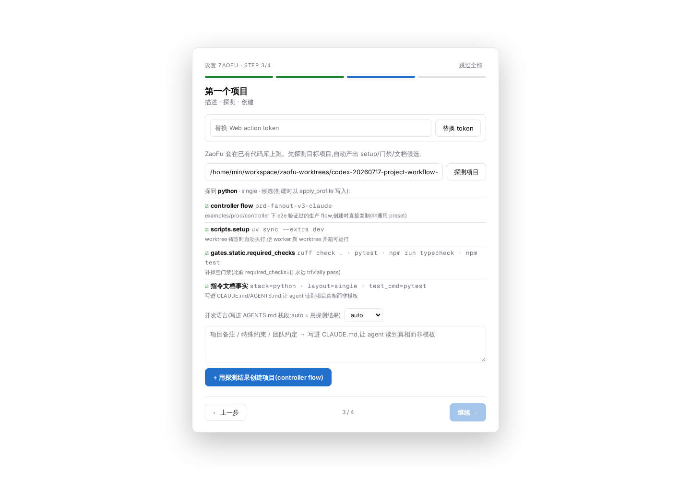
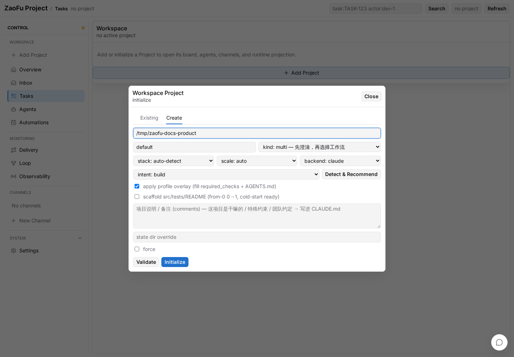

# 20 Project Creation, Bootstrap, and Workflow Ignition

> Audience: operators creating a ZaoFu Project from an empty directory or an
> existing repository, then safely submitting the first PRD, Issue, or
> Refactor workflow.
>
> Last verified against the CLI and Web UI: 2026-07-22.

## 1. Project, Request, and Run are different lifecycles

| Object | Meaning | Long lived |
|---|---|---|
| Project | Project root, canonical `zf.yaml`, state dir, workspace, and integrations | Yes |
| Request | One requirement clarification, acceptance contract, kind proposal, and ignition request | No; many per Project |
| Run | Immutable execution snapshot of an approved Request | No; many per Project |

Rules:

- `zf project init` creates a Project. It does not start a workflow by default.
- The default Project is a multi-kind container for PRD, Issue, Feature, and
  Refactor requests.
- A Request emits `workflow.invoke.requested` only after readiness passes and an
  explicit approval is applied.
- Keep one canonical `zf.yaml` and one configured `project.state_dir` for the
  Project. Do not create another control plane for later issues or features.

The ZaoFu source repository's root `zf.yaml` now defaults to the standard
`PrdFlow` for ZaoFu's own delivery work. It is not the new-project template.
New Projects still default to multi-kind and no ignition.

## 2. Four commands that serve different purposes

| Command | Purpose | Starts a workflow |
|---|---|---|
| `zf profile bootstrap` | Detect stack and recommend/materialize a Controller, checks, and instruction docs | No |
| `zf project init` | Create the Project container, `zf.yaml`, state dir, and optional workspace registration | No by default |
| `zf init` | Initialize or repair runtime state for an existing `zf.yaml` | No |
| `zf start` | Start workers, sidecars, and the watcher, then wait for entry events | Does not invent a Request |

The ignition action is `zf flow submit --apply`, or the explicit
`zf project init ... --apply` fast path. For a light topology, `flow submit
--apply` appends both the acceptance events and the correlated `prd.requested`
or `issue.requested` entry event in one `EventWriter` transaction. Do not emit
a second entry event manually; that would create another run identity.

## 3. CLI: create a default multi-kind Project

Set stable paths first:

```bash
export ZAOFU_ROOT=/path/to/zaofu
export TARGET_PROJECT=/path/to/my-product
```

### 3.1 Optional: inspect Bootstrap recommendations

For an existing repository, inspect without writing:

```bash
uv run --project "$ZAOFU_ROOT" zf profile bootstrap \
  "$TARGET_PROJECT" \
  --intent build \
  --backend claude \
  --scale launch
```

For an uninitialized new Project, stop after Inspect and use `project init` in
the next section to materialize the default multi-kind Project. `profile
bootstrap --apply` is a separate materialization path for explicitly choosing
the recommended single archetype as the initial config. Do not run both write
commands unconditionally against the same new Project.

Apply the Bootstrap result only when that is the selected path:

```bash
uv run --project "$ZAOFU_ROOT" zf profile bootstrap \
  "$TARGET_PROJECT" \
  --intent build \
  --backend claude \
  --scale launch \
  --apply
```

For an empty project, declare `--stack python|node|go|rust`. Add `--scaffold`
only when the minimal `src/`, `tests/`, and README skeleton is wanted.
Bootstrap never launches a provider. Multi-document Flow configs own their
gates, so Bootstrap Apply does not automatically fill `required_checks` into an
existing multi-kind `zf.yaml`; provide real project commands in the next step.

### 3.2 Initialize the Project container

Omit `--kind` to create the default multi-kind Project:

```bash
uv run --project "$ZAOFU_ROOT" zf project init \
  --name my-product \
  --root "$TARGET_PROJECT" \
  --create \
  --git-init \
  --backend claude \
  --workspace-register
```

This creates the root and canonical config, allocates Project-specific runtime
and session names, materializes Issue/PRD/Refactor routes, and registers the
Project. Issue defaults to one lane, PRD to two, and Refactor to five. It does
not submit a Request or emit a workflow invoke.

Remove `--git-init` for an existing Git repository. Remove `--create` when the
directory must already exist.

### 3.3 Review the materialized Project

`project init` creates a fail-closed template. Before ignition, replace the
selected kind document's `TODO` refs and configure executable mechanical gates
under the final `ZfConfig.spec`. For example:

```yaml
# PrdFlow.spec
prdRef: docs/intake/prd-account-security.md
targetRoot: app

# ZfConfig.spec
quality_gates:
  static:
    required_checks:
      - "cd app && npm run typecheck"
      - "cd app && npm test"
    on_fail: "candidate tree failed static gate; repair before reintegration"
workflow:
  rework_routing:
    static_gate.failed: prd-dev-lane-0
    test.failed: prd-dev-lane-0
```

Use commands that exist in the target repository and route failures to a real
implementation owner for that kind; multi-lane flows should preserve affinity.
Do not copy placeholders or bypass delivery verification with
`workflow.allow_unverified_candidate`.

```bash
cd "$TARGET_PROJECT"

uv run --project "$ZAOFU_ROOT" zf validate --path zf.yaml
uv run --project "$ZAOFU_ROOT" zf validate --cold-start
uv run --project "$ZAOFU_ROOT" zf skills doctor
uv run --project "$ZAOFU_ROOT" zf workflow inspect
uv run --project "$ZAOFU_ROOT" zf start --dry-run --no-watch
```

`workflow inspect` renders the full multi-kind static graph. It may include
diagnostics for an unselected kind or flag an event produced only by a runtime
bridge as having no static producer. The active Request's `flow preflight
--kind ...` is the ignition decision. Genuine `STOP` findings such as an
invalid rework target, missing role, or missing gate must still be fixed.

Before a real run, verify Project/state/session identity, provider login,
kind routes, executable quality checks, skill sources, workdir and Git refs,
and every remaining validation STOP or placeholder.

When `flow preflight` or `flow submit --dry-run` returns `STOP`, no invoke event
is emitted. Apply its `fix-it` guidance and rerun preflight. This is expected
readiness protection, not a failed runtime start.

## 4. CLI: clarify and ignite the first PRD

### 4.1 Create the Request intake

```bash
mkdir -p docs/intake

uv run --project "$ZAOFU_ROOT" zf flow intake \
  --kind prd \
  --objective "Implement the account security settings page" \
  --target app \
  --acceptance "Users can enable and disable two-factor authentication" \
  --acceptance "Unit and browser acceptance tests pass" \
  --request-id prd-account-security \
  --output docs/intake/prd-account-security.md
```

Incomplete input remains `clarifying` and does not create execution tasks.

### 4.2 Clarify and confirm the requirement snapshot

```bash
uv run --project "$ZAOFU_ROOT" zf flow clarify \
  --config zf.yaml \
  --intake docs/intake/prd-account-security.md \
  --constraint "Existing login sessions must remain compatible" \
  --acceptance "Failure cases show an actionable error" \
  --confirm \
  --json
```

Readiness requires a non-empty objective and acceptance contract, no open
questions, a resolved kind, the required roots, and a usable backend/profile/
lane/environment preflight. PRD requires a target root; Refactor requires both
source and target roots.

### 4.3 Preflight and preview without mutation

```bash
uv run --project "$ZAOFU_ROOT" zf flow preflight \
  --config zf.yaml \
  --kind prd \
  --intake docs/intake/prd-account-security.md \
  --json

uv run --project "$ZAOFU_ROOT" zf flow submit \
  --dry-run \
  --config zf.yaml \
  --intake docs/intake/prd-account-security.md \
  --kind prd \
  --json
```

Use `--allow-missing-env` only for a controlled dry-run or CI preview. Do not
hide a missing provider, Git, tmux, or test tool before a real run.

### 4.4 Start runtime, then explicitly ignite

Terminal A:

```bash
cd "$TARGET_PROJECT"
uv run --project "$ZAOFU_ROOT" zf start
```

Terminal B:

```bash
cd "$TARGET_PROJECT"
uv run --project "$ZAOFU_ROOT" zf flow submit \
  --apply \
  --config zf.yaml \
  --intake docs/intake/prd-account-security.md \
  --kind prd \
  --json
```

Stock kind routes already provide a pattern, so `--pattern-id` is normally
unnecessary. Supply it only for a custom route without a configured default.

Inspect the result:

```bash
uv run --project "$ZAOFU_ROOT" zf events --last 30
uv run --project "$ZAOFU_ROOT" zf status --workers
uv run --project "$ZAOFU_ROOT" zf kanban --board
```

A normal chain includes `workflow.submit.accepted` and
`workflow.invoke.requested`. Scan, plan, task-map, and Kanban tasks appear only
after the running runtime consumes the invoke.

## 5. One-command fast path for a complete requirement

Use this only when the requirement and acceptance contract are already clear:

```bash
uv run --project "$ZAOFU_ROOT" zf project init \
  --name account-service \
  --root /path/to/account-service \
  --create \
  --git-init \
  --backend claude \
  --request-kind prd \
  --objective "Deliver the account security settings page" \
  --target app \
  --acceptance "Unit and browser acceptance tests pass" \
  --workspace-register \
  --apply \
  --json
```

`--apply` cannot bypass missing fields or open questions. An incomplete Request
stays `clarifying` and fails closed without ignition.

## 6. When to use a single-kind Project

Compatibility entry points remain available:

```bash
zf project init --kind issue ...
zf project init --kind prd ...
zf project init --kind refactor ...
```

Use them only for a bounded Project that will not carry another request kind.
Long-lived products should stay multi-kind. Features use a light PRD route;
Issues default to one lane.

## 7. Web Project creation and Bootstrap Inspect

Enable controlled Web mutations and start the workspace shell:

```bash
export ZF_WEB_ACTION_TOKEN="$(openssl rand -hex 24)"
uv run --project "$ZAOFU_ROOT" zf web \
  --host 127.0.0.1 \
  --port 8001 \
  --workspace-only
```

In first-run onboarding:

1. Select a provider backend.
2. Pass the environment preflight.
3. Enter the target directory and run Bootstrap Inspect.
4. Review the Controller, setup, quality-check, and instruction candidates.
5. Open Add Project and select Create.
6. Use `kind: multi` for a long-lived Project, then select backend, stack,
   scale, and intent.
7. Select profile overlay or scaffold as needed, Validate, then Initialize.





Web Initialize has the same semantics as CLI `project init`: it creates and
registers the Project but does not ignite a workflow. Later requirements enter
the same Request service through Kanban Agent, Channel, or CLI.

## 8. Controlled ignition from Kanban Agent and Channel

- Kanban Agent may clarify the objective, acceptance criteria, and kind/tier/
  lane proposal.
- Channel consensus may move a Request to ready/proposed.
- Neither surface writes truth files or invokes a workflow directly.
- Final ignition requires a token-gated Web action, owner approval card, or CLI
  `--apply`.
- Revisions and requirement digests remain traceable under one `request_id`.

## 9. Troubleshooting

### Initialize completed but no tasks exist

This is expected. Initialize creates the Project. Approve a Request and verify
that the running watcher consumed `workflow.invoke.requested`.

### `zf start` produced idle panes

`zf start` starts runtime only. Workers correctly wait when there is no accepted
entry event.

### `flow submit --apply` was rejected

Inspect objective, acceptance, open questions, required roots, and preflight.
Do not forge an invoke event to bypass readiness.

### Dashboard says Project needs initialization

Verify that workspace `root`, `config_path`, and `state_dir_hint` identify the
same Project, then run `zf validate --cold-start` from the Project root.

### The repository root is PRD but a new Project is multi-kind

The root config is ZaoFu's own default workflow. `project init` is the product
Project-container entry point. Do not create an external Project by copying the
repository root config.

## 10. Completion checklist

- One canonical `zf.yaml` exists for the Project.
- State dir, tmux session, branch prefixes, and ports do not collide.
- Workspace registration and Dashboard switching resolve the correct Project.
- Bootstrap recommendations were reviewed and checks execute in the target.
- The Request has objective, acceptance, correct roots, and no open questions.
- Submit dry-run has no STOP; explicit approval precedes apply.
- The `zf start` watcher stays alive and events, tasks, and workers are visible.
- Stop only the configured Project with `zf stop`; never use `tmux kill-server`.
