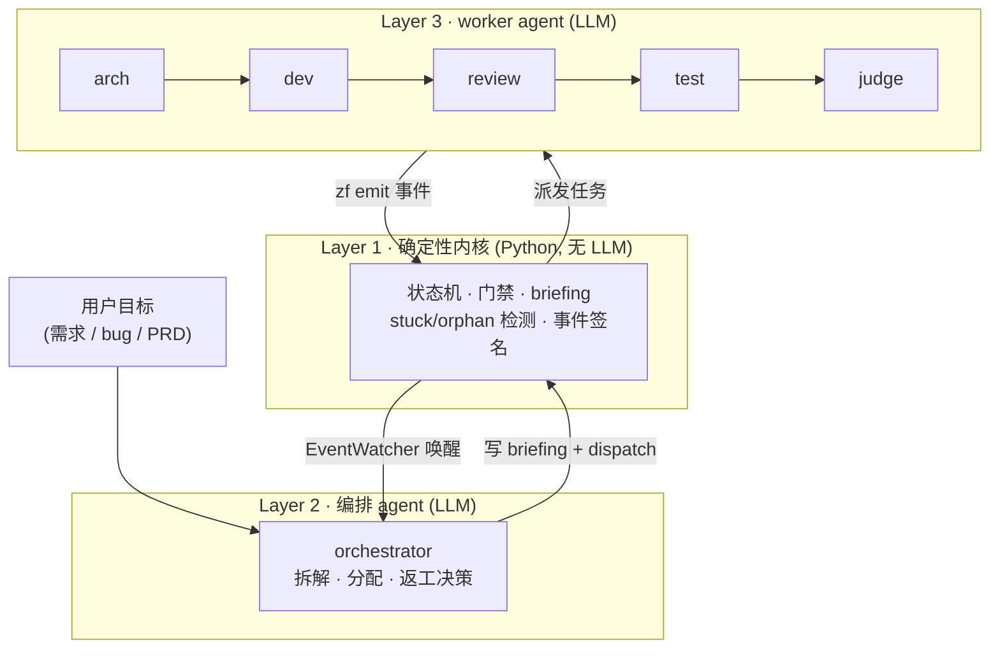
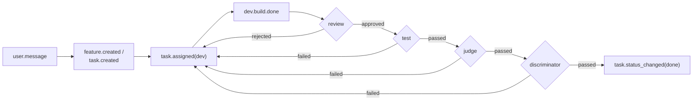

# ZaoFu 架构总览

> 适用对象: 想理解 ZaoFu 如何把"一句目标"推进到"经过验证的交付"的所有人。
> 本文是**自包含**的架构介绍 —— 读完即可理解后续操作手册里每条命令背后的模型,
> 无需任何额外材料。新用户建议读完本文再进 [01 快速开始](01-quickstart.md)。

## 1. ZaoFu 是什么

ZaoFu 是一个**多 agent 工程编排脚手架**:你给一个目标(一句话需求、一个 bug、一份 PRD),
它用一组分工的 AI agent(设计 / 实现 / 评审 / 测试 / 判定)协作把它推进到**可验证的交付**,
全过程的每一步都落成事件、可观测、可回放、可恢复。

它的设计目标不是"让 LLM 跑得快",而是**让长程多 agent 协作不失控**:不提前宣告完成、
不偷改测试、不越权改文件、卡住能自愈、成本有上限。

## 2. 三层架构

ZaoFu 把"确定性"和"智能"分开:机械、可验证的部分交给确定性内核(纯 Python,**不调 LLM**);
需要判断的部分交给 LLM agent。

| 层 | 角色 | 职责 | 关键特征 |
|---|---|---|---|
| **Layer 1 确定性内核** | zf-cli / runtime | 解析事件、推进状态机、执行门禁、生成 briefing、检测 stuck/orphan、签名事件 | 纯 Python,无 LLM,可单测,是"真相"的守护者 |
| **Layer 2 编排 agent** | orchestrator | 拆解目标、分配任务、处理返工、选择下一步 | LLM,但只通过事件和 CLI 表达意图,不直接改状态 |
| **Layer 3 worker agent** | arch / dev / review / test / judge | 设计、实现、评审、测试、最终判定 | LLM,在隔离工作区里干活,产出事件 + git evidence |



核心纪律:**agent 永远不直接写状态文件**,只 `zf emit` 事件;内核读事件、推进真相。
这条边界是整个系统可审计、可恢复的根。

## 3. 两个支柱:事件真相 + 单一控制面

### 3.1 `events.jsonl` —— 系统唯一真相

所有发生的事都是一条 append-only 事件(`events.jsonl`,每行一个 JSON,可带 HMAC 签名)。
**所有其它视图都从事件重建** —— kanban 看板、成本、Web dashboard、追踪图,都是"投影"(projection),
不是独立真相。这意味着:删掉任何投影都能从事件重放出来;任何状态争议都以事件流为准。

事件带**因果血缘**(谁触发了谁),所以一次交付的完整链路可以被追溯成一张图。

### 3.2 `zf.yaml` —— 唯一控制面

整个系统的行为由一个文件 `zf.yaml` 决定:有哪些角色、用什么后端(claude-code / codex)、
每个角色订阅什么事件(triggers)/发布什么事件(publishes)、有哪些质量门禁、安全约束怎么配。
**不存在第二个控制平面** —— 这是硬规则。运行态(事件、看板、会话、成本)落在 `.zf/` 目录,
不进 git,可随时重建。

## 4. 核心技术点

### 4.1 事件溯源与可观测

- **append-only**:事件只追加不修改,历史不可篡改。
- **因果血缘**:每个事件记录关联/起因,可还原"为什么会发生这一步"。
- **投影可重建**:看板、成本、Web 视图都是纯函数投影,坏了重放即可。
- 命令:`zf events --last N`、`zf trace delivery <feature_id>`、`zf watch --follow`。

### 4.2 任务模型:Kanban + Task Contract

- **Kanban**:任务在 `kanban.json` 里走 backlog → in-progress → done,迁移受事件守护
  (缺 `judge.passed` 等前置事件时,`zf kanban move ... done` 会被拒绝)。
- **WIP=1**:每个角色实例同时只做一个任务,避免上下文混淆。
- **Task Contract**:严格模式下每个任务带契约 —— `behavior`(要做什么)、`verification`
  (怎么验证)、`quality`(质量要求)、`out_of_scope`(明确不做)、`rework_delta`
  (返工时本轮相对上轮改了什么)、`dispatch_id`(调度令牌,防止旧会话/重复事件误关任务)。

### 4.3 状态机与质量门禁

标准任务走一条**阶段事件链**,每一步都是显式事件,内核据此推进:

```
dev.build.done → review.approved → test.passed → judge.passed → discriminator.passed → done
```

任一环失败(`review.rejected` / `test.failed` / `judge.failed`)按路由返工。两类门禁互补:

- **quality_gates**(命令级):检查"命令是否通过"(lint、build、测试命令)。
- **verification discriminator**(证据级):检查"证据是否足够、范围是否正确、是否满足契约、
  是否违反架构/规则"。即使 `judge.passed`,严格配置下仍可能被 `discriminator.failed` 打回。

这套机制专门**防止提前宣告完成** —— agent 嘴上说"做完了"不算数,必须有合法事件链 + 证据。

### 4.4 约束与安全

ZaoFu 用分层约束防止 agent 越权:

- **Protected Paths**:`tests/**`、`specs/**`、`.zf/**`、`roles/**` 等任何 dev agent 不得修改
  (防止改测试让测试通过、防止篡改自身约束),由路径守卫强制拦截。
- **约束继承链**:有效约束 = 全局 ∪ 角色 ∪ 任务,**下层只能收窄不能放宽**。启动时校验一致性,
  矛盾则拒绝启动。
- **Tool Closure(工具权限闭包)**:防止 `deny: [Write]` 却 `allow: [Bash]` 用 bash 绕过写限制 ——
  启动时算权限传递闭包,发现矛盾直接报错。
- **Scope Ratchet**:turn 结束时比对实际改动,越界文件自动回滚并记 `scope.violation` 事件。
- **事件签名**:`events.jsonl` 每行可 HMAC 签名(密钥在 `loop.lock` 的 session secret),配合
  `nonces/` 防重放,保证事件不可伪造。

> **诚实说明(生产前必读):** 上述安全特性大多是**可配置且出厂偏保守/默认关闭**的
> (签名、scope 强制、权限闭包、脱敏需在 `zf.yaml` 的 `safety.*` 显式开启)。
> ZaoFu 的信任模型在**全部开启时**才完整成立;对外/生产部署前请逐项开启并验证,
> 不要假设开箱即处于最强约束。

### 4.5 长任务韧性与恢复

长程任务的三类风险,内核都有处理:

| 风险 | 触发 | 处理 |
|---|---|---|
| worker stuck | pane/session 长时间无进展 | 写 stuck 事件,尝试恢复/重启/重投递 |
| task orphan | 任务 in-progress 但久无阶段事件 | warning → escalate → 可 requeue |
| context 过大 | provider 上下文超阈值 | warning 先 checkpoint;compact 阈值压缩;hard cap 阻止新派发 |

加上 **Bounded Rework**(`max_rework_attempts`:同一任务返工超上限则升级,不无限循环)
和 checkpoint / recovery,保证长任务**不会静默卡死,也不会无限烧钱**。

### 4.6 编排与事件驱动唤醒

`zf start --foreground` 启动 `EventWatcher`:新事件命中 wake pattern 时唤醒 orchestrator;
即使无事件也周期 tick,驱动 stuck/orphan/context 扫描。状态推进有两种:

- **Layer 1 机械转移**:确定的状态迁移(如 `dev.build.done` → 派发给 review)内核直接做,不唤醒 LLM。
- **Layer 2 唤醒**:需要判断时(如返工选谁、异常处理)才唤醒 orchestrator —— 省成本。

角色间通过 `triggers`(订阅)/ `publishes`(发布)在 `zf.yaml` 里声明耦合;
outbound 用 tmux 或 stream-json transport 把 briefing 送给 agent。

### 4.7 隔离与证据

- **Skills 分层**:角色能用的技能按层组合,最小授权。
- **Workdir 隔离**:`runtime.workdirs.mode: worktree` 让每个 writer 在独立 git worktree 干活,
  并行不互踩。
- **Git Evidence**:每次交付能定位 base / head / log / diff,证据可追溯到真实代码改动 ——
  done 不只是"说做完了",而是"指得出改了哪几行"。

### 4.8 成本与指标

每个 turn 的成本记到 `cost.jsonl`,累计物化到 `cost_state.json`;预算可设上限,
超预算阻断新派发。`zf metrics snapshot` / `zf cost` 给出可审计的成本与吞吐视图。

## 5. 一次任务的端到端生命周期



任何失败都回到 dev(或按契约 / workflow 路由到 arch),受 `max_rework_attempts` 上限保护。

## 6. 运行态目录 `.zf/`(不进 git,可重建)

| 文件 | 内容 |
|---|---|
| `events.jsonl` | append-only 事件流(每行可 HMAC 签名)—— 唯一真相 |
| `kanban.json` | 看板投影 |
| `session.yaml` / `role_sessions.yaml` | 会话与角色绑定 |
| `cost.jsonl` / `cost_state.json` | per-turn 成本与累计 |
| `memory/` | 角色记忆(shared / arch / dev / review / test) |
| `loop.lock` | 运行锁 + session secret(事件签名用) |
| `logs/` | harness 与各 agent 日志 |

删掉任何投影都能从 `events.jsonl` 重放;`.zf/` 不该手工编辑,一律通过 ZaoFu 命令变更。

## 下一步

- [01 快速开始](01-quickstart.md) — 装好就跑
- [02 zf.yaml 控制面](02-zf-yaml-control-plane.md) — 把上面的概念落成配置
- [04 Harness 运行流程](04-harness-runtime.md) — 任务链路与签收口径的操作细节
- [03 CLI 操作手册](03-cli-operations.md) — 日常命令
